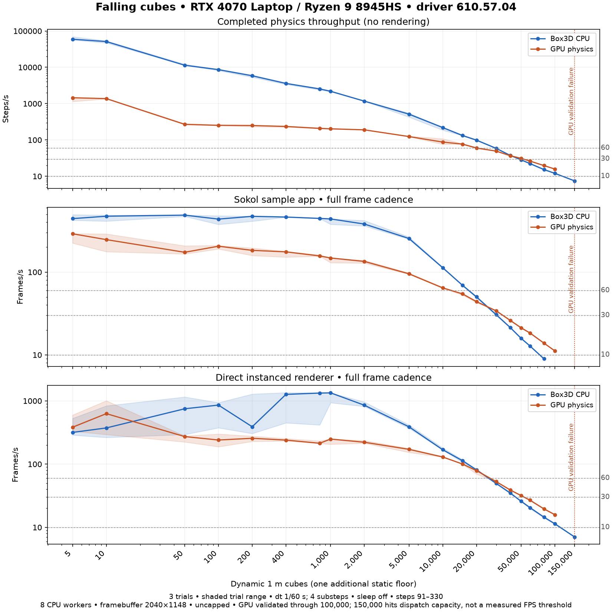
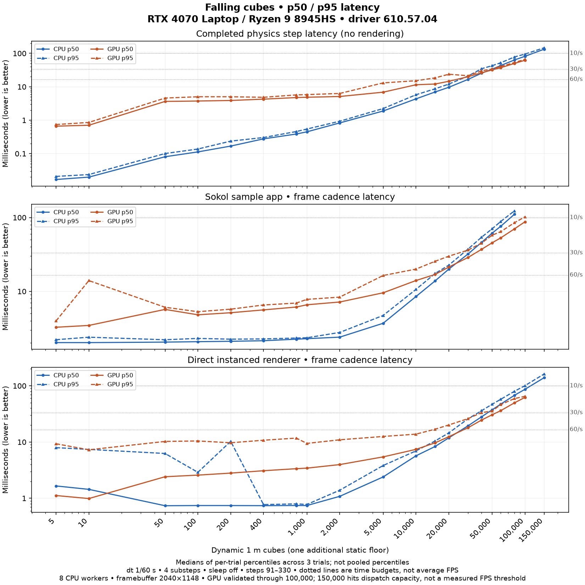
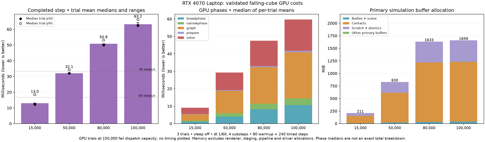
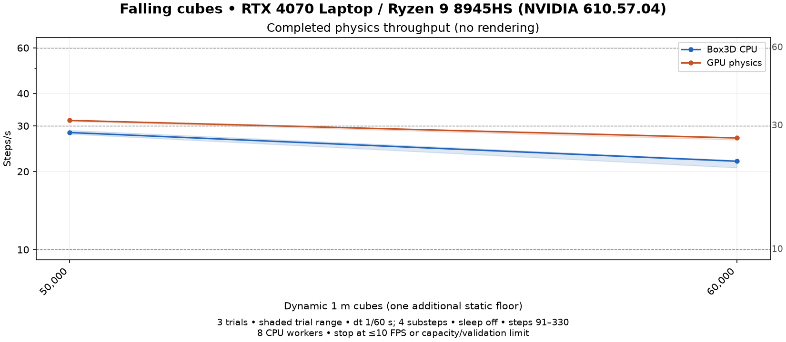
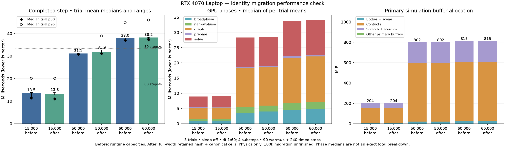
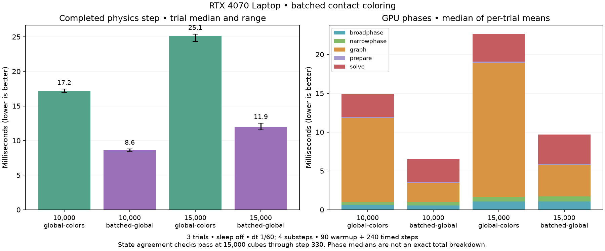
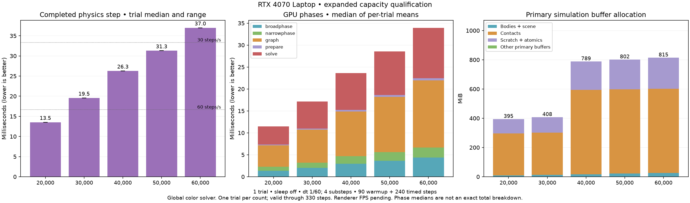
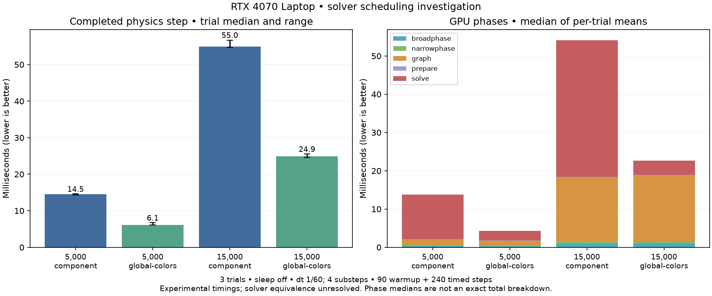

# GPU physics experiment

An experimental Rust/WGSL rigid-body engine with a Box3D-compatible C interface
and native sample viewers. It is separate from the Box3D WASM package; the
upstream `box3d/` sources remain unchanged.

**Compatibility is incomplete.** Linux NVIDIA and AMD have local runtime coverage;
macOS and Windows build paths await CI and hardware verification. See
[status, work priorities and missing features](../../docs/gpu-physics.md).

## Build and run

Initialize the submodule with `git submodule update --init --recursive`. Install
Bun, Python 3.10+, Rust, CMake 3.24+ and a native C/C++ toolchain. Additional
platform dependencies are in the [backend guide](compiler/native-backend/README.md).
From the repository root:

```sh
bun run samples:cpu     # upstream Box3D
bun run samples:gpu     # experimental GPU engine
bun run samples:both    # independent CPU and GPU worlds, side by side
bun run samples:both --build-only
```

The launcher chooses a capable hardware adapter. Linux defaults to cached Vulkan
when its build prerequisites are available; macOS prefers Metal and Windows
prefers DX12. It does not force a GPU vendor or change driver selection.

```sh
GPU_PHYSICS_SAMPLES_NATIVE_CACHE=0 bun run samples:both  # ordinary backend
GPU_PHYSICS_ADAPTER=amd bun run samples:gpu
GPU_PHYSICS_POWER_PREFERENCE=low bun run samples:gpu
```

These examples use POSIX shell syntax. In PowerShell, set an override with
`$env:GPU_PHYSICS_ADAPTER = 'amd'`, then run the Bun command.
See the [backend guide](compiler/native-backend/README.md) for strict overrides,
cache eligibility and build directories.

## Using the comparison viewer

CPU is on the left and GPU on the right. Both panes share the camera, sample
controller, settings, pause (`p`) and single-step controls. The bottom-left
checkbox switches to an overlapping view.

Click selects; **Ctrl + left-drag** grabs. Matching pane coordinates produce the
same ray, but each world uses its own hit, depth, anchor and motor joint. A miss
can leave one side ungrabbed. The other pane shows a matching cursor. Release,
focus loss and scene changes end the gesture.

Poses and simulation state stay independent. Warm starting is fixed on for GPU
worlds, so its toggle is replaced by a label.
Recording is unavailable in GPU/combined mode. The combined worker slider is
labelled CPU-only; GPU-only mode reports automatic scheduling.

The inspector is GPU-led; the shared sample controller means sample-specific
event/query logic is not two
independent application instances. Unsupported APIs can affect sample behavior;
consult the [limitations](../../docs/gpu-physics.md#missing-features-and-known-failures).

**GPU API / Shape Replacement** cycles one live shape through sphere, capsule,
box and cylinder geometry. IDs and metadata stay stable; alternating replacements
explicitly recompute body mass. The [replacement fixture and semantics](../../docs/gpu-physics.md#native-shape-replacement)
cover independent CPU/GPU state and rendering.

For sustained spawning, set expected peak body/shape counts in
`b3WorldDef.capacity` before creating the world, and destroy expired projectiles
so their slots can be reused. Automatic headroom and geometric growth handle
unplanned additions; compiled programs survive buffer growth. See the
[capacity and resource ownership notes](../../docs/gpu-physics.md#architecture-and-state-ownership).

GPU loading displays preparation stages while buffers and shaders are prepared.
Worlds do not step during loading. Driver compilation can delay shutdown until
worker teardown is safe. Pipeline caching can be disabled with
`GPU_PHYSICS_PIPELINE_CACHE=0` or relocated with `GPU_PHYSICS_PIPELINE_CACHE_DIR`.
Native precision shaders now parse and validate their shared source once per
process, then specialize individual entry points. Previously 110 entry points
reparsed the same source on each launch even with a warm driver cache. Two local
RTX 4070 Laptop warm sample launches now prepared in 1.51–1.76 s; first-launch
shader/driver work still takes longer. `GPU_PHYSICS_TRACE_PIPELINES=1` reports
preparation timings. `GPU_PHYSICS_VERIFY_SHADER_REUSE=1` recompiles independently
and checks byte-identical SPIR-V; use it for validation, not timing. All 110
startup entry points matched, and the four precision tests passed on NVIDIA and
AMD. Generated SPIR-V is still cached in memory; the disk cache holds driver
pipelines.

## Direct Rust viewer

From this directory:

```sh
cargo run --release -- --scene box-stack
cargo run --release -- --scene mixed-stacks --bodies 4096
```

Esc quits, `[` / `]` change scenes and `R` restarts. `--no-sleep` keeps bodies
active; normal interactive use allows sleep. `--mp4 output.mp4 --frames 300`
records a clip using FFmpeg. Run `cargo run --release -- --help` for scene options.

`--bodies` means dynamic box count for `mixed-stacks` and `falling-cubes`, sphere count for `spheres`,
pendulum count for `anchored-mechanisms`, link count for `joint-chain`, and ring
count for `dominoes`. The default Dominoes fixture has 30 rings.

## Falling-cube scaling benchmark

**2026-09-24: Ryzen 9 8945HS / RTX 4070 Laptop (8,188 MiB), NVIDIA 610.57.04.**
GPU completed physics throughput beats the 8-worker Box3D CPU by **28.5% at
80,000 cubes** and **31.2% at 100,000**. Every paired trial exceeds 20% at both
adjacent measured counts (24.7–34.7% and 30.2–31.4%). CPU remains substantially
faster at small counts; the completed-physics crossover first appears at 50,000
in this sweep. These results qualify this falling-cube collision window, not
arbitrary scenes or a FLOPS-based prediction for another GPU.

| Cubes | CPU / GPU physics steps/s | CPU / GPU Sokol FPS | CPU / GPU direct FPS |
|---:|---:|---:|---:|
| 15,000 | 132.34 / 76.84 | 69.33 / 54.61 | 113.26 / 100.44 |
| 30,000 | 58.69 / 49.27 | 30.61 / 34.03 | 49.50 / 52.91 |
| 50,000 | 28.35 / 31.19 | 15.87 / 21.23 | 25.86 / 31.81 |
| 80,000 | 15.33 / 19.70 | 8.96 / 13.86 | 14.49 / 19.59 |
| 100,000 | 12.05 / 15.82 | — / 11.19 | 11.40 / 15.88 |
| 150,000 | 7.47 / — | — / — | 7.05 / — |

The **50,000-cube / 30 FPS stretch is met in average direct-renderer cadence**:
all three GPU trials reach 31.57–31.99 FPS (median 31.81), versus CPU 25.86 FPS.
Median trial p95 is 35.59 ms, so this is not a locked 30 FPS. Both renderers use
the same physics workload; rendering features differ, so compare CPU/GPU within
each panel. Completed physics steps/s and application frame cadence are separate
measurements; the direct viewer drains queued work at the end of its timed window.





Each valid count/mode has three fresh-world trials, alternating mode order,
90 warmup + 240 timed steps, dt 1/60 s, four substeps and sleeping off. Rates are
the reciprocal of median trial mean time; p50/p95 are medians of trial percentiles,
not pooled percentiles. Shading preserves trial ranges, including substantial
small-count desktop cadence variability. Actual application framebuffer: 2040×1148.
Sokol uploads every cube and the floor; saved renderer culling cannot omit them.

AC remained connected. Runs used normal desktop load without an idle gate.
Before/after snapshots record load, GPU clocks, temperature and power; observed
GPU power limits range from 33 to 55 W. These are laptop operating conditions,
not continuous telemetry or a fixed-power desktop GPU comparison. Re-run the
same workload on another machine rather than scaling these rates by nominal FLOPS.

Threshold brackets below mean **last sampled count above → first at or below**
the target average rate. They are not interpolated capacities or p95 guarantees.

| Path | 60 steps/s or FPS | 30 steps/s or FPS | 10 steps/s or FPS |
|---|---:|---:|---:|
| physics-cpu | 20,000 → 30,000 | 40,000 → 50,000 | 100,000 → 150,000 |
| physics-gpu | 20,000 → 30,000 | 50,000 → 60,000 | Not reached; >10 at 100,000 |
| sokol-cpu | 15,000 → 20,000 | 30,000 → 40,000 | 60,000 → 80,000 |
| sokol-gpu | 10,000 → 15,000 | 30,000 → 40,000 | Not reached; >10 at 100,000 |
| direct-cpu | 20,000 → 30,000 | 40,000 → 50,000 | 100,000 → 150,000 |
| direct-gpu | 20,000 → 30,000 | 50,000 → 60,000 | Not reached; >10 at 100,000 |

**Current capacity boundary:** all three GPU paths fail at 150,000 cubes before
producing a valid timing. A geometric broadphase reservation reaches 4,194,304
entries, requiring 65,536 workgroups of 64 in a one-dimensional dispatch; the
device permits 65,535. This is a software dispatch-layout limit, not measured VRAM
exhaustion or a 10 FPS result. The chart retains 100,000 as the largest validated
sampled GPU count and marks the failed 150,000 attempt separately. Further scaling
requires tiled dispatch with matching indices in direct, indirect and cached
command paths; removing the assertion alone would be unsafe.

At 100,000 cubes, graph construction costs 26.5 ms, solving 18.0 ms,
and broadphase 10.6 ms. Primary simulation buffers occupy **1,659 MiB
(1.62 GiB)**, including 1,184 MiB of contact buffers. Rendering, staging, pipelines
and driver allocations are excluded. Graph construction is the largest measured
phase and the next performance target after dispatch tiling.



The sweep contains 345 valid trials and three rejected capacity failures, whose
logs are retained. Correctness evidence includes 260 NVIDIA library tests,
high-index cache-opt-out coverage, native metadata ASan/UBSan fixtures and
independent CPU/GPU shape replacement checks. Fixed 16-bit pair identities and
native 65,535-entry metadata/renderer limits are removed; device dispatch and
buffer limits still apply.

[Full data and thresholds](benchmarks/rtx4070-complete-scene-2026-09-24.json)
· [Timing table](benchmarks/rtx4070-complete-scene-2026-09-24-timings.md)
· [Phase and memory data](benchmarks/rtx4070-complete-scene-phases-2026-09-24.json)
· [Raw results, source snapshots, tests and reproduction scripts](benchmarks/rtx4070-complete-scene-2026-09-24-raw.tar.gz)
· [Archive SHA-256](benchmarks/rtx4070-complete-scene-2026-09-24-raw.tar.gz.sha256)

The comparison grid has refreshed CPU oracle and GPU columns for all 19 standard
scenes (`000-box3d-cpu`, `2026-09-24-throughput-scaling`): 300 frames per clip.
[Recording identities and clip checks](benchmarks/rtx4070-complete-scene-recordings-2026-09-24.json)
retain binary/clip hashes. These ordinary scene recordings are separate from the
no-sleep timed benchmark; GPU default metrics cover 18 scenes and omit Dominoes,
whose clip is still recorded. Run `bun run compare` to inspect the grid.

The [earlier full-width checkpoint](benchmarks/rtx4070-full-width-crossover-2026-09-24.json)
and its [raw archive](benchmarks/rtx4070-full-width-2026-09-24-raw.tar.gz) independently
show the same 80k/100k crossover. The optimization comparisons below retain their
own source revisions and matched before/after settings.

**Earlier matched CPU/GPU checkpoint (before identity migration),
2026-09-24: Ryzen 9 8945HS / RTX 4070 Laptop, NVIDIA 610.57.04.** Three alternating trials show a GPU physics throughput
advantage of **11.4% at 50,000 cubes** and **23.0% at 60,000** with global color
solving. The trial ranges do not overlap at either count. All three 60,000-cube
trials clear 20%; none of the 50,000-cube trials does. At this earlier checkpoint the two-count 20% target and
100,000-body support were still open; the latest results above supersede those
limits. The full sweep above supersedes this checkpoint. These are completed physics steps/s, not app FPS.

| Cubes | CPU / GPU steps/s | CPU p50 / p95 ms | GPU p50 / p95 ms | GPU throughput advantage |
|---:|---:|---:|---:|---:|
| 50,000 | 28.28 / 31.49 | 34.92 / 41.32 | 31.39 / 33.86 | 11.4% |
| 60,000 | 21.91 / 26.94 | 45.53 / 52.25 | 36.67 / 38.64 | 23.0% |

Rates use the median trial mean; p50/p95 are medians of the trial percentiles.
Both engines use 4 substeps, sleeping disabled, 90 warmup steps and 240 measured
steps; CPU uses 8 workers. AC was connected, with no idle gate. Raw records
include before/after power, clocks, temperature and load; these endpoint samples
include idle transitions and are not a continuous power trace.



[Timings, variability, and per-trial speed ratios](benchmarks/rtx4070-crossover-checkpoint-2026-09-24.json)
· [Raw trials, settings, compiled-source snapshot, and test proof](benchmarks/rtx4070-crossover-checkpoint-2026-09-24-raw.tar.gz)
· [Archive SHA-256](benchmarks/rtx4070-crossover-checkpoint-2026-09-24-raw.tar.gz.sha256)

To rerun the matched comparison on current source after a native-cache release build
(the archive above preserves the exact earlier source and settings):

```bash
python3 scripts/bench-falling-cubes.py artifacts/falling-cubes/crossover-check \
  --counts 50000 60000 --modes physics-cpu physics-gpu \
  --trials 3 --workers 8 --gpu-solver global
```

**Later identity-migration check.** Full-width retained-contact lookup and canonical
cell ownership remove the online packed-key deduplication dependency. The engine
passes all 258 NVIDIA library tests, including an independent all-pairs comparison
and duplicate-emission checks. Three alternating before/after trials retain the
same falling-cube and solver settings. This is a correctness/scalability step,
not a demonstrated throughput improvement:

| Cubes | Before / after completed step ms | Change in step time |
|---:|---:|---:|
| 15,000 | 13.54 / 13.27 | −2.0%; overlapping trial ranges |
| 50,000 | 31.11 / 31.90 | +2.5% |
| 60,000 | 37.97 / 38.24 | +0.7%; overlapping trial ranges |

All 18 runs pass validation and final contact counts match between variants.
At 60,000 cubes, median broadphase cost increases from 4.36 to 4.85 ms; graph
construction and solving remain larger costs. Primary buffer allocation is
unchanged. The chart shows median trial means, trial ranges, p50/p95, phase costs,
and primary memory (excluding staging, renderers, pipelines, and driver overhead).
This intermediate checkpoint predates the full pair/history migration and the
100,000-cube CPU comparison above. Renderer FPS still needs remeasurement.



[Timing and memory summary](benchmarks/rtx4070-identity-preparation-2026-09-24.json)
· [Raw trials, source snapshots, test proof, and reproduction script](benchmarks/rtx4070-identity-preparation-2026-09-24-raw.tar.gz)
· [Archive SHA-256](benchmarks/rtx4070-identity-preparation-2026-09-24-raw.tar.gz.sha256)

<details>
<summary>Earlier sweep: retained diagnostics, not current performance evidence</summary>

The original sweep predates the island-union fix and scalable GPU capacities.
Its GPU capacity checks first failed at 20,000 cubes, and later tests exposed
lost island connections in the earlier solver. These timings are retained for
diagnosis; they are not a correctness-preserving baseline for speedup claims.

The old Sokol CPU curve also lacks complete-instance validation. Its fixed
65,536-shape reservation and saved 100 m draw distance could omit objects;
the latter culled the entire CPU scene in a subsequent 100,000-cube check.
Those application rates and thresholds are not full-scene performance evidence.
New runs reserve the full scene, use a 1,000 m draw distance, and verify every
uploaded instance on both engines. Completed CPU physics measurements are
unaffected by these renderer issues.

Original raw files remain unchanged for audit:
[historical report](benchmarks/rtx4070-laptop-2026-09-24.json),
[hardware/power conditions](benchmarks/rtx4070-laptop-2026-09-24-conditions.json),
[raw measurements and source snapshots](benchmarks/rtx4070-laptop-2026-09-24-raw.tar.gz),
[archive SHA-256](benchmarks/rtx4070-laptop-2026-09-24-raw.tar.gz.sha256).
The [small-count repeat check](benchmarks/rtx4070-laptop-2026-09-24-repeat-check.json)
reproduced wide presentation timing ranges; no slower valid trial was replaced.

</details>

The `falling-cubes` workload compares real Box3D CPU physics with this GPU engine
in three paths: completed physics steps without rendering, the Sokol sample app,
and the direct Rust instanced renderer. Each CPU/GPU pair uses the same scene,
time step and renderer. The direct renderer reads GPU body buffers without the
sample app's CPU pose mirror and debug-draw construction. Its CPU counterpart
runs independent Box3D physics and uploads its own transforms.

The fixture uses 1 m cubes, one floor and up to ten layers. Layer spacing is
1.25 m with alternating ±0.125 m offsets; starting heights are 6–17.25 m. Counts
are dynamic cubes, excluding the floor. Gravity is −10 m/s², dt is 1/60 s with
four substeps, default materials, and sleeping is disabled. Measurements cover
steps 91–330 (1.5–5.5 simulated seconds), including landing and pile settling.
This measures an awake falling pile, not continuous spawning or sleeping-world
performance. The C viewers/oracle share a scene header; the Rust fixture uses
exact binary-fraction coordinates, checked against the CPU viewer at startup.

Benchmark windows ignore interactive key/mouse controls; normal viewers retain
them. The sweep runs three trials per path/count, reversing path order on alternate
trials. FPS is the reciprocal of the median **trial mean** frame/step time;
p50 and p95 milliseconds and trial ranges are retained. App timings use full
frame cadence, including presentation and a final device drain in the direct
viewer. GPU physics timings wait for completion. Startup, allocation and shader
loading occur before the timed window. Sokol's physics submission time alone is
not completed GPU simulation time. Cameras frame the whole workload, with each
viewer's own camera, lighting, UI and shading; this is an application comparison,
not an isolated renderer microbenchmark.

The following real viewer captures use 1,000 cubes, four substeps and sleeping
disabled on the NVIDIA GPU, both at 2040×1148. They were captured separately,
outside timing runs, at different simulation steps. Sokol includes its debug UI;
the direct renderer uses its own camera and shading. The on-screen timing in the
Sokol preview is illustrative and is not a benchmark result.

| Sokol sample app | Direct instanced renderer |
|---|---|
|  |  |

Each path stops independently at ≤10 FPS, invalid results, or a real capacity
limit. The default count schedule extends to 1,000,000 cubes, with each path
stopping at its own measured threshold or validation limit. Physics and the direct renderer use full-width
shape pairs and can test beyond 65,535 dynamic cubes, subject to device capacity
and validation. Native GPU metadata and CPU/GPU identity mappings use per-world
chunk tables. Both Sokol paths reserve at least `GPU_BENCH_CUBES + 1` debug
shapes and opaque instances per stream, then verify that all cubes plus the floor
reach each frame's renderer upload. `GPU_SAMPLES_SHAPE_CAPACITY` sets an explicit
startup reservation for other scenes; the ordinary default is 65,536. The pool
keeps stable pointers for the app lifetime. Transparent-stream limits are unchanged.
Falling Cubes fixes its draw distance at 1,000 m; the harness records saved renderer
settings and rejects changes to them during a sweep. Dropped
pairs/contacts, invalid bodies,
incomplete windows and mismatched framebuffers invalidate a measurement. The
physics/direct GPU paths check final completed state; Sokol's asynchronous
contact telemetry is checked throughout. Thresholds are brackets between tested
counts, not interpolated capacities or guarantees for other scenes.

Build before measuring, so compiler work does not compete with the benchmark:

```sh
# From experiments/gpu-physics, on the supported Linux native-cache path:
python3 scripts/run-native-samples.py cpu --build-only
python3 scripts/run-native-samples.py gpu --build-only
./scripts/build-native-cache.sh build --release
cmake --build oracle/build --target box3d_oracle -j 6
python3 scripts/check-viewer-cpu.py

# Real desktop display; these driver overrides match the measured NVIDIA laptop.
export __NV_PRIME_RENDER_OFFLOAD=1
export __GLX_VENDOR_LIBRARY_NAME=nvidia
export VK_DRIVER_FILES=/usr/share/vulkan/icd.d/nvidia_icd.json
python3 scripts/bench-falling-cubes.py artifacts/falling-cubes/my-machine \
  --adapter nvidia --gpu-solver global --timeout 900
# Plotting alone requires matplotlib; measurement uses the Python standard library.
python3 scripts/plot-falling-cubes.py artifacts/falling-cubes/my-machine \
  benchmarks/my-machine --title 'Exact CPU / GPU / driver'
```

`--require-idle` checks background load before each trial and stops without losing
completed trials if CPU use exceeds 15% or NVIDIA GPU use exceeds 10%. A busy
two-second reading is confirmed over a full ten-second CPU averaging window,
so a brief spike does not abort the sweep. GPU readings retain the 10% ceiling.
Each trial retains its idle-check evidence, and atomic checkpoint writes preserve completed
trials and terminal failures across interruption (`scripts/check-falling-resume.py`
exercises this recovery). Repeat the same command with `--resume` after interruption; it requires unchanged binaries, settings
and environment. The optional idle gate may be changed when resuming; the resume
history and individual trials record that policy. Without `--require-idle`, runs
proceed under normal desktop load. Use the repeated-trial ranges and saved load
telemetry to investigate unusually inconsistent results, retaining all valid trials.

To isolate solver scheduling costs, `profile-falling-solvers.py` reuses a completed
sweep's binary and environment, verifies its binary hash, and compares component
TGS with global contact-color dispatches. It alternates variant order across three
trials and preserves raw phase timings and machine telemetry. Both variants retain
the falling-cube workload, timestep, four substeps, and disabled sleeping. These
are diagnostic comparisons; promoting a scheduling change still requires solver
agreement checks and the full CPU/renderer sweep.

```sh
python3 scripts/profile-falling-solvers.py artifacts/falling-cubes/my-machine/manifest.json \
  artifacts/solver-profile --counts 5000 15000
python3 scripts/plot-falling-solvers.py artifacts/solver-profile benchmarks/solver-profile \
  --title 'Exact GPU • solver scheduling investigation'
```

The plot rechecks raw-file hashes and trial means, displays completed-step trial
ranges and median trial p50/p95 markers, and separates broadphase, narrowphase, graph construction, preparation,
and solving. Phase bars use medians of per-trial means; their sum is not presented
as an exact decomposition of median completed-step time.

The scaling investigation found and fixed a concurrent island-union bug: an
unconditional atomic minimum could overwrite an earlier parent link and lose a
connection. Compare-and-exchange now attaches only a node that is still a root.
The 15,000-cube regression checks every dynamic contact's island membership and
compares repeated global solves, component solves, and batched graph construction
at steps 1, 65, 78, 79, 90, 150, and 330. All sampled positions, rotations, and
linear/angular velocities match exactly after the fix.

Dynamic coloring now fetches and publishes endpoints cooperatively in batches of
256 contacts, while retaining the reference greedy decision order. Its shared
cache holds at most 512 endpoints rather than the entire world. Worlds above
8,168 bodies select this path automatically; smaller worlds retain their existing
shared/memo scheduling. `GPU_PHYSICS_GRAPH_BATCHED=0` forces the scalar reference
and `=1` forces batching for controlled comparisons. Global color solving can
still be selected with `GPU_PHYSICS_COMPONENT_TGS=0`; component TGS remains useful
for small independent islands but underutilizes the GPU on a large connected pile.
Spatial-hash insertion storage now grows geometrically with reserved shape
capacity (16 entries per reserved shape, rounded to a power of two, at least
1,024, also covering graph-prefix workspace). The three insertion arrays sit after the scene's fat bounds; their
runtime offsets avoid shader recompilation on growth. Oversized workloads still
report sticky capacity loss rather than silently dropping entries. Contact pools
now reserve 16 slots per reserved body, rounded to a power of two (minimum 256),
and pair capacity follows that reservation with a 65,536-entry floor. Runtime
scratch/hash offsets and chunked prefix scans replace the old fixed ceiling.
Growth preserves contact state and history, relocates occupied lists, and rebuilds
the hash index without compiling new shader variants. Capacity loss still
invalidates the run; unusually dense workloads may exhaust their reservation. A 30,000-cube first-step
regression records 100,305 spatial entries without capacity loss, exceeding the
old limit. The combined NVIDIA library suite passes all 260 tests, including the insertion
boundary, full-width sorting and contact hashing, compaction beyond 65,536 entries,
contact-cache growth, and canonical coloring regressions.
The general static-contact sort now carries full contact indices and sorts on
32-bit body/color keys, removing its `(body << 16) | index` packing. It preserves
canonical contact order between its two stable sorts and retains four radix
passes per sort. Retained-contact lookup now stores two full-width identity words
per physical slot and publishes only the slot reference into the hash table.
A separate preparation dispatch makes both words visible before publication;
retirement leaves them intact until the next allocation phase. This uses the
existing hash allocation and also applies when growth or topology changes rebuild
the index. Grid pair generation now assigns each overlap one exact shared cell,
using insertion ordinals to distinguish cells even when their hash buckets collide.
Retained roots emit their existing pairs once; new overlaps append directly, so
pair generation no longer needs an online atomic packed-key deduplication table.
The independent all-pairs matrix agrees through cell collisions and mutations,
and raw append counts equal unique counts in those fixtures.
Broadphase pairs, retained-contact identities, previous-touching history,
callbacks, events, graph memoization, joint filters, and material lookup now
carry full 32-bit indices for both endpoints. Persistent contacts add an aligned
16-byte identity field; pair, history, and radix arrays use two words per entry.
Sorting preserves high-index-major order and skips unused high bytes: four
passes through 65,536 shapes, six through 16,777,216, then eight. Tests cover all
three widths and high-index contacts through callbacks, events, deletion/remapping,
and slot reuse. The Rust physics slot guards now reflect the public index and
graph-classification ranges rather than a 16-bit pair encoding. Device allocation
limits still apply. Native sample metadata uses stable-address chunks per world,
with direct-index geometry lookup and cleanup; independent CPU mappings also
check generations. `scripts/check-native-metadata.sh` exercises 100,001 entries,
callback growth, world isolation, reuse, and ownership under ASan/UBSan.
The batched pipeline is prepared at world initialization and reused across worlds
and capacity growth, so crossing the selection threshold does not compile a shader.

With the island fix present in both variants, three alternating trials show:

| Cubes | Global solver, scalar graph: mean / p50 / p95 ms | Global solver, batched graph: mean / p50 / p95 ms |
|---:|---:|---:|
| 10,000 | 17.16 / 16.86 / 18.17 | 8.60 / 8.45 / 9.59 |
| 15,000 | 25.14 / 24.38 / 28.14 | 11.93 / 11.00 / 14.21 |

Each cell reports the median across trial statistics. At 15,000 cubes, median
graph phase time falls from 17.25 to 4.05 ms. This improves completed physics-step
throughput in this earlier diagnostic. The completed larger-count CPU/renderer
sweep above now demonstrates the crossover after capacity expansion.



[Current profile summary](benchmarks/rtx4070-batched-graph-2026-09-24.json)
· [Raw trials, source patches, and agreement logs](benchmarks/rtx4070-batched-graph-2026-09-24-raw.tar.gz)
· [Archive SHA-256](benchmarks/rtx4070-batched-graph-2026-09-24-raw.tar.gz.sha256)

Reproduce with `profile-falling-solvers.py --counts 10000 15000 --variants
global-colors batched-global`, using a manifest for the current compiled binary.
The archive also preserves the intermediate 64-contact batch experiment and the
island-fix-only comparison; headline results use 256-contact batches.
The archive includes the passing 253-test NVIDIA library log and its source
snapshot. Dataset manifests identify the measured binary and source patch;
per-run `source_sha256` is a runtime working-tree observation, not a compiled
source fingerprint. These diagnostic runs precede automatic path selection and
the completed-wait status refresh; a final default-path sweep remains pending.

New completed-step raw runs include `allocations` for primary simulation buffers:
body state, the complete reserved scene heap (including geometry and materials),
contacts, joints, scratch, atomics, and fixed dispatch/query buffers. These are
allocated buffer bytes, excluding readback/timestamp staging, CCD resources,
renderers, pipelines, and driver overhead; they must not be labeled total VRAM.


The expanded-capacity build completes the same collision-heavy window at 20,000,
30,000, 40,000, 50,000, and 60,000 cubes without sticky capacity loss or escaped/
nonfinite bodies. One qualification trial per count gives mean completed steps
of 13.53, 19.55, 26.28, 31.30, and 36.99 ms respectively. These are physics times;
renderer FPS requires separate measurements; the fresh repeated physics
comparison above covers 50,000 and 60,000.
At 60,000 cubes the primary simulation buffers occupy about 815 MiB. The jump
between 30,000 and 40,000 reflects geometric reservations, not a sudden increase
in live collision complexity.



[Qualification timings and memory](benchmarks/rtx4070-capacity-qualification-2026-09-24.json)
· [Raw trials, compiled-source snapshot, and 256-test proof](benchmarks/rtx4070-capacity-qualification-2026-09-24-raw.tar.gz)
· [Archive SHA-256](benchmarks/rtx4070-capacity-qualification-2026-09-24-raw.tar.gz.sha256)

For fresh CPU comparisons, `bench-falling-cubes.py --gpu-solver global` selects
the same global-color schedule and records the choice. `--gpu-binary PATH`
lets physics/direct runs use a preserved executable while work continues.
The default still selects component TGS; all comparisons must report this setting.

<details>
<summary>Historical first diagnostic — before the island-union fix</summary>

The initial scheduling experiment reduced measured completed-step time from
14.50 to 6.09 ms at 5,000 cubes and 54.97 to 24.94 ms at 15,000. Its subsequent
agreement test exposed the island bug: maximum position disagreement reached
8.98 m at step 330. These timings remain diagnostic history, not a qualified
CPU crossover or a correctness-preserving performance baseline.



[Historical summary](benchmarks/rtx4070-solver-profile-2026-09-24.json)
· [Historical raw trials and failing-test log](benchmarks/rtx4070-solver-profile-2026-09-24-raw.tar.gz)
· [Archive SHA-256](benchmarks/rtx4070-solver-profile-2026-09-24-raw.tar.gz.sha256)

</details>

The runner records adapter/driver, CPU, VRAM, power/clock telemetry, framebuffer,
settings, commands and binary hashes. Keep the raw output directory. To compare
a second PC, repeat the same workload/window/worker count/resolution and retain
both datasets. Report measured throughput ratios and CPU differences; GPU model
names or advertised FLOPS alone do not predict this workload's scaling. Host
submission, memory traffic, contact graph work and rendering can each limit it.

## Validation and recordings

Run from this directory on Linux with the required GPU/build dependencies:

```sh
python3 scripts/test-native-portability.py
python3 scripts/test-sokol-capacity.py
cargo test --release --lib -- --test-threads=1
./scripts/correctness-gate.sh artifacts/correctness-review.json
./scripts/native-scene-gate.sh
./scripts/check-both-pointer.sh
./scripts/check-shape-replacement.sh
./scripts/check-native-metadata.sh # Linux; requires the built CPU oracle
./scripts/check-joint-separation.sh
./scripts/check-joint-reaction.sh
./scripts/check-substep-forces.sh
./scripts/check-spawn-stream.sh
python3 scripts/audit-native-api.py --require-complete
```

The API audit intentionally fails while coverage is incomplete. It selects the
same portable build directories as the launcher; `--gpu-build-dir` and
`--both-build-dir` select explicit builds. Use `--require-built` to reject missing
artifacts without requiring full API parity. Missing artifacts are reported as
unknown coverage. Symbol coverage does not certify semantics.
Several diagnostic scripts retain Linux/NVIDIA assumptions. Required checks
reported as skipped or unsupported do not count as passes.

The default Vulkan precision path passes normal and strict ten-drag checks on
Linux Radeon 780M and RTX 4070 Laptop, with independent histories and unchanged
tolerances. After `check-both-pointer.sh`, run the produced `both-drag` binary with
`--ground-strict` on each adapter using `scripts/native-samples-cache-env.sh`.
See [qualification results](../../docs/gpu-physics.md#ground-drag-qualification)
for exact commands, limits and remaining failures.

For drag phase traces, build the fixtures first with `check-both-pointer.sh`,
then select the same build and library. For the cached Linux build:

```sh
GPU_PHYSICS_ADAPTER=amd DRAG_PHASE_RANGE=60:240 ./scripts/check-drag-phases.sh \
  artifacts/drag-phases-amd native-samples/build-both-native-cache-portable \
  target/native-cache-build/release/libgpu_physics.a
```

The diagnostic returns failure when the original strict drag gate fails, while
retaining `result.log` and `phases.log`. Tracing can change scheduling and floating-point code generation, so confirm
findings with the uninstrumented fixture too. Without build/library arguments,
it uses the ordinary portable build produced with caching disabled. For joint/contact
boundaries, also set `DRAG_CONSTRAINT_TRACE=1` and
`GPU_PHYSICS_AB=phase-capture,mesh-candidates`; trace overflow invalidates the
diagnostic. CPU phases 100/101 bracket relaxed joint solves, 102/103 biased solves.
`BOTH_DRAG_TRACE_BODY=-1` traces all five cubes; `B <frame> <cube-index>` records
identify the following state/contact lines. Values 0–4 retain single-cube tracing.

For visual or solver changes, record the affected scenes before committing:

```sh
./scripts/record-box3d-oracle.sh
./scripts/record-snapshot.sh YYYY-MM-DD-label
bun run compare
```

To capture a measured build without rebuilding it, set `GPU_RECORD_BIN` to its
absolute executable path. `GPU_RECORD_ORACLE` similarly preserves a specific CPU
oracle for the first column. Both scripts write `recording-manifest.json` with
binary hashes, requested frame counts, and GPU environment settings. Use the
same solver environment as the run being illustrated, and record outside timing
runs so capture and encoding do not affect benchmark results.

The grid places the real Box3D CPU reference first, followed by GPU snapshots.
Reports and recordings are ignored local outputs under `artifacts/` and
`recordings/`; fresh clones must regenerate them. They are not distributed via
Git LFS. Historical investigations are retained in Git history and local archives.

## Source map

| Path | Purpose |
|---|---|
| `src/api/`, `src/c_abi.rs` | World API and exported bridge |
| `src/sim.rs`, `shaders/` | GPU scheduling and physics kernels |
| `c_abi/` | Native compatibility layer and reference fixtures |
| `native-samples/` | CPU, GPU and combined Sokol viewers |
| `oracle/` | Upstream Box3D reference executable |
| `compiler/` | Optional pinned Vulkan backend patches |
| `scripts/` | Builds, correctness checks, recordings and benchmarks |

Architecture and current limitations: [GPU physics notes](../../docs/gpu-physics.md).
Measured performance and reproduction: [native backend guide](compiler/native-backend/README.md).
