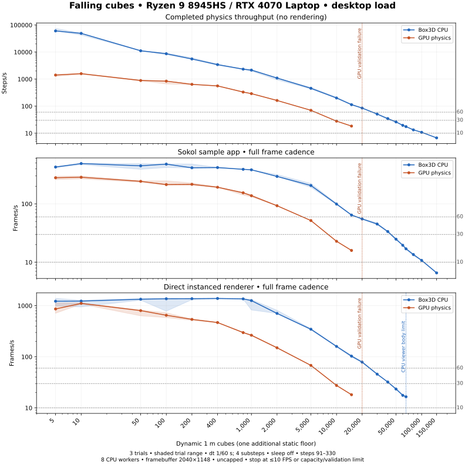

# GPU physics experiment

An experimental Rust/WGSL rigid-body engine with a Box3D-compatible C interface
and native sample viewers. It is separate from the Box3D WASM package; the
upstream `box3d/` sources remain unchanged.

**Compatibility is incomplete.** Linux NVIDIA and AMD have local runtime coverage;
macOS and Windows build paths await CI and hardware verification. See
[status, work priorities and missing features](../../docs/gpu-physics.md).

## Build and run

Initialize the submodule with `git submodule update --init --recursive`. Install
Bun, Python 3.10+, Rust, CMake 3.24+ and a native C/C++ toolchain. Additional
platform dependencies are in the [backend guide](compiler/native-backend/README.md).
From the repository root:

```sh
bun run samples:cpu     # upstream Box3D
bun run samples:gpu     # experimental GPU engine
bun run samples:both    # independent CPU and GPU worlds, side by side
bun run samples:both --build-only
```

The launcher chooses a capable hardware adapter. Linux defaults to cached Vulkan
when its build prerequisites are available; macOS prefers Metal and Windows
prefers DX12. It does not force a GPU vendor or change driver selection.

```sh
GPU_PHYSICS_SAMPLES_NATIVE_CACHE=0 bun run samples:both  # ordinary backend
GPU_PHYSICS_ADAPTER=amd bun run samples:gpu
GPU_PHYSICS_POWER_PREFERENCE=low bun run samples:gpu
```

These examples use POSIX shell syntax. In PowerShell, set an override with
`$env:GPU_PHYSICS_ADAPTER = 'amd'`, then run the Bun command.
See the [backend guide](compiler/native-backend/README.md) for strict overrides,
cache eligibility and build directories.

## Using the comparison viewer

CPU is on the left and GPU on the right. Both panes share the camera, sample
controller, settings, pause (`p`) and single-step controls. The bottom-left
checkbox switches to an overlapping view.

Click selects; **Ctrl + left-drag** grabs. Matching pane coordinates produce the
same ray, but each world uses its own hit, depth, anchor and motor joint. A miss
can leave one side ungrabbed. The other pane shows a matching cursor. Release,
focus loss and scene changes end the gesture.

Poses and simulation state stay independent. Warm starting is fixed on for GPU
worlds, so its toggle is replaced by a label.
Recording is unavailable in GPU/combined mode. The combined worker slider is
labelled CPU-only; GPU-only mode reports automatic scheduling.

The inspector is GPU-led; the shared sample controller means sample-specific
event/query logic is not two
independent application instances. Unsupported APIs can affect sample behavior;
consult the [limitations](../../docs/gpu-physics.md#missing-features-and-known-failures).

**GPU API / Shape Replacement** cycles one live shape through sphere, capsule,
box and cylinder geometry. IDs and metadata stay stable; alternating replacements
explicitly recompute body mass. The [replacement fixture and semantics](../../docs/gpu-physics.md#native-shape-replacement)
cover independent CPU/GPU state and rendering.

For sustained spawning, set expected peak body/shape counts in
`b3WorldDef.capacity` before creating the world, and destroy expired projectiles
so their slots can be reused. Automatic headroom and geometric growth handle
unplanned additions; compiled programs survive buffer growth. See the
[capacity and resource ownership notes](../../docs/gpu-physics.md#architecture-and-state-ownership).

GPU loading displays preparation stages while buffers and shaders are prepared.
Worlds do not step during loading. Driver compilation can delay shutdown until
worker teardown is safe. Pipeline caching can be disabled with
`GPU_PHYSICS_PIPELINE_CACHE=0` or relocated with `GPU_PHYSICS_PIPELINE_CACHE_DIR`.
Native precision shaders now parse and validate their shared source once per
process, then specialize individual entry points. Previously 110 entry points
reparsed the same source on each launch even with a warm driver cache. Two local
RTX 4070 Laptop warm sample launches now prepared in 1.51–1.76 s; first-launch
shader/driver work still takes longer. `GPU_PHYSICS_TRACE_PIPELINES=1` reports
preparation timings. `GPU_PHYSICS_VERIFY_SHADER_REUSE=1` recompiles independently
and checks byte-identical SPIR-V; use it for validation, not timing. All 110
startup entry points matched, and the four precision tests passed on NVIDIA and
AMD. Generated SPIR-V is still cached in memory; the disk cache holds driver
pipelines.

## Direct Rust viewer

From this directory:

```sh
cargo run --release -- --scene box-stack
cargo run --release -- --scene mixed-stacks --bodies 4096
```

Esc quits, `[` / `]` change scenes and `R` restarts. `--no-sleep` keeps bodies
active; normal interactive use allows sleep. `--mp4 output.mp4 --frames 300`
records a clip using FFmpeg. Run `cargo run --release -- --help` for scene options.

`--bodies` means dynamic box count for `mixed-stacks` and `falling-cubes`, sphere count for `spheres`,
pendulum count for `anchored-mechanisms`, link count for `joint-chain`, and ring
count for `dominoes`. The default Dominoes fixture has 30 rings.

## Falling-cube scaling benchmark

**Measured 2026-09-24: Ryzen 9 8945HS / NVIDIA RTX 4070 Laptop.** No GPU-over-CPU
crossover appeared in the three-trial medians at any matched valid count
(5–15,000 cubes), in any of the three paths. At 5,000 cubes the GPU completed
70.2 physics steps/s, the direct renderer delivered 67.9 FPS, and Sokol delivered
51.8 FPS; CPU physics completed 457.5 steps/s. These results describe this
experimental engine and falling-pile fixture, not GPU physics in general.



| Measurement conditions | Value |
|---|---|
| OS | Linux 6.12.108-1-MANJARO x86-64 |
| CPU | AMD Ryzen 9 8945HS, 8 cores / 16 threads; 8 physics workers |
| GPU | NVIDIA GeForce RTX 4070 Laptop, 8,188 MiB VRAM; driver 610.57.04; Vulkan native-cache backend |
| Power | AC connected; reported GPU ceiling varied **33–55 W**; requested/default ceiling 55 W |
| Recorded GPU telemetry | 44–62 °C, 2.42–51.88 W draw, 210–2,355 MHz SM clock, including idle samples |
| App framebuffer | **2040×1148**, uncapped; Sokol swap interval 0, direct viewer Immediate presentation |
| Runs | Three trials per count/path, alternating order; normal desktop activity and load telemetry retained |

The initial optional idle gate was removed during this dataset; the archive
records the policy change for each subsequent trial. Earlier September 20
busy-desktop diagnostic datasets are **excluded**. This is a laptop/system
measurement with variable power limits, not a fixed-power GPU rating.

Thresholds below are **last tested count above → first tested count at/below**
the requested rate. Physics rates are completed steps/s; app rates are frames/s.

| Path | 60 threshold | 30 threshold | 10 threshold / stopping limit |
|---|---:|---:|---|
| CPU physics | 20,000 → 30,000 | 40,000 → 50,000 | 100,000 → 150,000 |
| GPU physics | 5,000 → 10,000 | 5,000 → 10,000 | Capacity failure at 20,000; 18.3 steps/s at 15,000 |
| Sokol + CPU | 15,000 → 20,000 | 40,000 → 50,000 | 100,000 → 150,000 |
| Sokol + GPU | 2,000 → 5,000 | 5,000 → 10,000 | Capacity failure at 20,000; 15.9 FPS at 15,000 |
| Direct + CPU | 20,000 → 30,000 | 40,000 → 50,000 | Viewer ceiling: 65,535 cubes, 16.5 FPS |
| Direct + GPU | 5,000 → 10,000 | 5,000 → 10,000 | Capacity failure at 20,000; 18.1 FPS at 15,000 |

All three GPU paths rejected the 20,000-cube case because the broadphase dropped
spatial-hash cell insertions: [`MAX_INSERTS`](src/types.rs) is fixed at 65,536,
and a cube may occupy several cells. **15,000 is the largest tested valid GPU
count, not an exact maximum.** Those failed timings are not plotted as performance
results. A faster GPU alone cannot raise this fixed buffer capacity. The direct
CPU viewer has a separate 65,536-body GPU-side scene limit (one slot is the floor),
although its physics runs on Box3D CPU. The independent CPU oracle and Sokol app
continued to 150,000 cubes, reaching 6.7 steps/s and 6.6 FPS respectively.

The shaded bands retain all original trials. Three extra trials at 5, 100 and
1,000 cubes checked unusually wide direct-renderer ranges. They reproduced
small-count presentation variability: at 5 cubes, two CPU-viewer trials had
`Surface::present` p50 values of 0.60 and 1.22 ms while physics submission stayed
near 0.04–0.05 ms. The [follow-up report](benchmarks/rtx4070-laptop-2026-09-24-repeat-check.json)
is separate; no slower valid trial was replaced or removed. Near-ties at very
small counts should not be read as a reliable crossover.

<details>
<summary>All tested counts: median rates (CPU / GPU)</summary>

| Cubes | Physics CPU / GPU | Sokol CPU / GPU | Direct CPU / GPU |
|---:|---:|---:|---:|
| 5 | 60,413.8 / 1,412.8 | 426.5 / 279.7 | 1,222.7 / 862.8 |
| 10 | 49,094.8 / 1,590.1 | 489.7 / 285.3 | 1,229.9 / 1,109.3 |
| 50 | 11,139.6 / 887.1 | 447.8 / 242.8 | 1,336.9 / 800.8 |
| 100 | 8,671.8 / 842.3 | 478.8 / 213.7 | 1,365.7 / 649.5 |
| 200 | 5,548.4 / 641.0 | 414.1 / 215.8 | 1,370.2 / 539.6 |
| 400 | 3,437.8 / 561.2 | 418.4 / 192.3 | 1,384.4 / 468.4 |
| 800 | 2,332.2 / 331.9 | 390.3 / 154.7 | 1,359.2 / 297.4 |
| 1000 | 2,152.4 / 290.4 | 382.5 / 137.9 | 1,257.7 / 264.2 |
| 2000 | 1,096.2 / 162.4 | 294.6 / 92.8 | 705.8 / 150.1 |
| 5000 | 457.5 / 70.2 | 206.2 / 51.8 | 346.0 / 67.9 |
| 10000 | 200.6 / 27.9 | 99.2 / 22.9 | 159.6 / 27.5 |
| 15000 | 113.5 / 18.3 | 64.3 / 15.9 | 103.0 / 18.1 |
| 20000 | 85.0 / — | 55.1 / — | 78.5 / — |
| 30000 | 51.0 / — | 45.2 / — | 45.8 / — |
| 40000 | 34.8 / — | 33.6 / — | 32.1 / — |
| 50000 | 26.2 / — | 24.8 / — | 23.4 / — |
| 60000 | 19.6 / — | 19.5 / — | 17.6 / — |
| 65535 | 17.5 / — | 17.0 / — | 16.5 / — |
| 80000 | 13.3 / — | 13.6 / — | — / — |
| 100000 | 10.8 / — | 10.8 / — | — / — |
| 150000 | 6.7 / — | 6.6 / — | — / — |

“—” means no valid measurement at that count. Physics columns are steps/s;
Sokol/direct columns are frames/s.

</details>

[Completed report, thresholds and trial ranges](benchmarks/rtx4070-laptop-2026-09-24.json)
· [Recorded hardware/power conditions](benchmarks/rtx4070-laptop-2026-09-24-conditions.json)
· [p50/p95 milliseconds for every path/count](benchmarks/rtx4070-laptop-2026-09-24-timings.md)
· [Raw measurements, logs, source snapshots and repeat checks](benchmarks/rtx4070-laptop-2026-09-24-raw.tar.gz)
· [Archive SHA-256](benchmarks/rtx4070-laptop-2026-09-24-raw.tar.gz.sha256)

The `falling-cubes` workload compares real Box3D CPU physics with this GPU engine
in three paths: completed physics steps without rendering, the Sokol sample app,
and the direct Rust instanced renderer. Each CPU/GPU pair uses the same scene,
time step and renderer. The direct renderer reads GPU body buffers without the
sample app's CPU pose mirror and debug-draw construction. Its CPU counterpart
runs independent Box3D physics and uploads its own transforms.

The fixture uses 1 m cubes, one floor and up to ten layers. Layer spacing is
1.25 m with alternating ±0.125 m offsets; starting heights are 6–17.25 m. Counts
are dynamic cubes, excluding the floor. Gravity is −10 m/s², dt is 1/60 s with
four substeps, default materials, and sleeping is disabled. Measurements cover
steps 91–330 (1.5–5.5 simulated seconds), including landing and pile settling.
This measures an awake falling pile, not continuous spawning or sleeping-world
performance. The C viewers/oracle share a scene header; the Rust fixture uses
exact binary-fraction coordinates, checked against the CPU viewer at startup.

Benchmark windows ignore interactive key/mouse controls; normal viewers retain
them. The sweep runs three trials per path/count, reversing path order on alternate
trials. FPS is the reciprocal of the median **trial mean** frame/step time;
p50 and p95 milliseconds and trial ranges are retained. App timings use full
frame cadence, including presentation and a final device drain in the direct
viewer. GPU physics timings wait for completion. Startup, allocation and shader
loading occur before the timed window. Sokol's physics submission time alone is
not completed GPU simulation time. Cameras frame the whole workload, with each
viewer's own camera, lighting, UI and shading; this is an application comparison,
not an isolated renderer microbenchmark.

The following real viewer captures use 1,000 cubes, four substeps and sleeping
disabled on the NVIDIA GPU, both at 2040×1148. They were captured separately,
outside timing runs, at different simulation steps. Sokol includes its debug UI;
the direct renderer uses its own camera and shading. The on-screen timing in the
Sokol preview is illustrative and is not a benchmark result.

| Sokol sample app | Direct instanced renderer |
|---|---|
|  |  |

Each path stops independently at ≤10 FPS, invalid results, or a real capacity
limit. The default sweep reaches 60,000 cubes; explicit CPU-only extensions can
reach 1,000,000 if needed. GPU paths and the direct CPU viewer cannot exceed
65,535 dynamic cubes because their GPU-side scene uses 16-bit body IDs. The
independent CPU oracle and CPU Sokol app can continue beyond that. Dropped
pairs/contacts, invalid bodies,
incomplete windows and mismatched framebuffers invalidate a measurement. The
physics/direct GPU paths check final completed state; Sokol's asynchronous
contact telemetry is checked throughout. Thresholds are brackets between tested
counts, not interpolated capacities or guarantees for other scenes.

Build before measuring, so compiler work does not compete with the benchmark:

```sh
# From experiments/gpu-physics, on the supported Linux native-cache path:
python3 scripts/run-native-samples.py cpu --build-only
python3 scripts/run-native-samples.py gpu --build-only
./scripts/build-native-cache.sh build --release
cmake --build oracle/build --target box3d_oracle -j 6
python3 scripts/check-viewer-cpu.py

# Real desktop display; these driver overrides match the measured NVIDIA laptop.
export __NV_PRIME_RENDER_OFFLOAD=1
export __GLX_VENDOR_LIBRARY_NAME=nvidia
export VK_DRIVER_FILES=/usr/share/vulkan/icd.d/nvidia_icd.json
python3 scripts/bench-falling-cubes.py artifacts/falling-cubes/my-machine --adapter nvidia
# Continue surviving CPU paths beyond the default count list if needed.
python3 scripts/bench-falling-cubes.py artifacts/falling-cubes/my-machine-cpu-extension \
  --counts 65535 80000 100000 150000 200000 400000 800000 1000000 \
  --modes physics-cpu sokol-cpu direct-cpu
# Plotting alone requires matplotlib; measurement uses the Python standard library.
python3 scripts/plot-falling-cubes.py artifacts/falling-cubes/my-machine \
  benchmarks/my-machine --additional-input artifacts/falling-cubes/my-machine-cpu-extension \
  --title 'Exact CPU / GPU / driver'
```

`--require-idle` checks background load before each trial and stops without losing
completed trials if CPU use exceeds 15% or NVIDIA GPU use exceeds 10%. A busy
two-second reading is confirmed over a full ten-second CPU averaging window,
so a brief spike does not abort the sweep. GPU readings retain the 10% ceiling.
Each trial retains its idle-check evidence, and atomic checkpoint writes preserve completed
trials and terminal failures across interruption (`scripts/check-falling-resume.py`
exercises this recovery). Repeat the same command with `--resume` after interruption; it requires unchanged binaries, settings
and environment. The optional idle gate may be changed when resuming; the resume
history and individual trials record that policy. Without `--require-idle`, runs
proceed under normal desktop load. Use the repeated-trial ranges and saved load
telemetry to investigate unusually inconsistent results, retaining all valid trials.

The runner records adapter/driver, CPU, VRAM, power/clock telemetry, framebuffer,
settings, commands and binary hashes. Keep the raw output directory. To compare
a second PC, repeat the same workload/window/worker count/resolution and retain
both datasets. Report measured throughput ratios and CPU differences; GPU model
names or advertised FLOPS alone do not predict this workload's scaling. Host
submission, memory traffic, contact graph work and rendering can each limit it.

## Validation and recordings

Run from this directory on Linux with the required GPU/build dependencies:

```sh
python3 scripts/test-native-portability.py
cargo test --release --lib -- --test-threads=1
./scripts/correctness-gate.sh artifacts/correctness-review.json
./scripts/native-scene-gate.sh
./scripts/check-both-pointer.sh
./scripts/check-shape-replacement.sh
./scripts/check-joint-separation.sh
./scripts/check-joint-reaction.sh
./scripts/check-substep-forces.sh
./scripts/check-spawn-stream.sh
python3 scripts/audit-native-api.py --require-complete
```

The API audit intentionally fails while coverage is incomplete. It selects the
same portable build directories as the launcher; `--gpu-build-dir` and
`--both-build-dir` select explicit builds. Use `--require-built` to reject missing
artifacts without requiring full API parity. Missing artifacts are reported as
unknown coverage. Symbol coverage does not certify semantics.
Several diagnostic scripts retain Linux/NVIDIA assumptions. Required checks
reported as skipped or unsupported do not count as passes.

The default Vulkan precision path passes normal and strict ten-drag checks on
Linux Radeon 780M and RTX 4070 Laptop, with independent histories and unchanged
tolerances. After `check-both-pointer.sh`, run the produced `both-drag` binary with
`--ground-strict` on each adapter using `scripts/native-samples-cache-env.sh`.
See [qualification results](../../docs/gpu-physics.md#ground-drag-qualification)
for exact commands, limits and remaining failures.

For drag phase traces, build the fixtures first with `check-both-pointer.sh`,
then select the same build and library. For the cached Linux build:

```sh
GPU_PHYSICS_ADAPTER=amd DRAG_PHASE_RANGE=60:240 ./scripts/check-drag-phases.sh \
  artifacts/drag-phases-amd native-samples/build-both-native-cache-portable \
  target/native-cache-build/release/libgpu_physics.a
```

The diagnostic returns failure when the original strict drag gate fails, while
retaining `result.log` and `phases.log`. Tracing can change scheduling and floating-point code generation, so confirm
findings with the uninstrumented fixture too. Without build/library arguments,
it uses the ordinary portable build produced with caching disabled. For joint/contact
boundaries, also set `DRAG_CONSTRAINT_TRACE=1` and
`GPU_PHYSICS_AB=phase-capture,mesh-candidates`; trace overflow invalidates the
diagnostic. CPU phases 100/101 bracket relaxed joint solves, 102/103 biased solves.
`BOTH_DRAG_TRACE_BODY=-1` traces all five cubes; `B <frame> <cube-index>` records
identify the following state/contact lines. Values 0–4 retain single-cube tracing.

For visual or solver changes, record the affected scenes before committing:

```sh
./scripts/record-box3d-oracle.sh
./scripts/record-snapshot.sh YYYY-MM-DD-label
bun run compare
```

The grid places the real Box3D CPU reference first, followed by GPU snapshots.
Reports and recordings are ignored local outputs under `artifacts/` and
`recordings/`; fresh clones must regenerate them. They are not distributed via
Git LFS. Historical investigations are retained in Git history and local archives.

## Source map

| Path | Purpose |
|---|---|
| `src/api/`, `src/c_abi.rs` | World API and exported bridge |
| `src/sim.rs`, `shaders/` | GPU scheduling and physics kernels |
| `c_abi/` | Native compatibility layer and reference fixtures |
| `native-samples/` | CPU, GPU and combined Sokol viewers |
| `oracle/` | Upstream Box3D reference executable |
| `compiler/` | Optional pinned Vulkan backend patches |
| `scripts/` | Builds, correctness checks, recordings and benchmarks |

Architecture and current limitations: [GPU physics notes](../../docs/gpu-physics.md).
Measured performance and reproduction: [native backend guide](compiler/native-backend/README.md).
