# GPU physics experiment

An experimental Rust/WGSL rigid-body engine with a Box3D-compatible C interface
and native sample viewers. It is separate from the Box3D WASM package; the
upstream `box3d/` sources remain unchanged.

**Compatibility is incomplete.** Linux NVIDIA and AMD have local runtime coverage;
macOS and Windows build paths await CI and hardware verification. See
[status, work priorities and missing features](../../docs/gpu-physics.md).

## Build and run

Initialize the submodule with `git submodule update --init --recursive`. Install
Bun, Python 3.10+, Rust, CMake 3.24+ and a native C/C++ toolchain. Additional
platform dependencies are in the [backend guide](compiler/native-backend/README.md).
From the repository root:

```sh
bun run samples:cpu     # upstream Box3D
bun run samples:gpu     # experimental GPU engine
bun run samples:both    # independent CPU and GPU worlds, side by side
bun run samples:both --build-only
```

The launcher chooses a capable hardware adapter. Linux defaults to cached Vulkan
when its build prerequisites are available; macOS prefers Metal and Windows
prefers DX12. It does not force a GPU vendor or change driver selection.

```sh
GPU_PHYSICS_SAMPLES_NATIVE_CACHE=0 bun run samples:both  # ordinary backend
GPU_PHYSICS_ADAPTER=amd bun run samples:gpu
GPU_PHYSICS_POWER_PREFERENCE=low bun run samples:gpu
```

These examples use POSIX shell syntax. In PowerShell, set an override with
`$env:GPU_PHYSICS_ADAPTER = 'amd'`, then run the Bun command.
See the [backend guide](compiler/native-backend/README.md) for strict overrides,
cache eligibility and build directories.

## Using the comparison viewer

CPU is on the left and GPU on the right. Both panes share the camera, sample
controller, settings, pause (`p`) and single-step controls. The bottom-left
checkbox switches to an overlapping view.

Click selects; **Ctrl + left-drag** grabs. Matching pane coordinates produce the
same ray, but each world uses its own hit, depth, anchor and motor joint. A miss
can leave one side ungrabbed. The other pane shows a matching cursor. Release,
focus loss and scene changes end the gesture.

Poses and simulation state stay independent. Warm starting is fixed on for GPU
worlds, so its toggle is replaced by a label.
Recording is unavailable in GPU/combined mode. The combined worker slider is
labelled CPU-only; GPU-only mode reports automatic scheduling.

The inspector is GPU-led; the shared sample controller means sample-specific
event/query logic is not two
independent application instances. Unsupported APIs can affect sample behavior;
consult the [limitations](../../docs/gpu-physics.md#missing-features-and-known-failures).

**GPU API / Shape Replacement** cycles one live shape through sphere, capsule,
box and cylinder geometry. IDs and metadata stay stable; alternating replacements
explicitly recompute body mass. The [replacement fixture and semantics](../../docs/gpu-physics.md#native-shape-replacement)
cover independent CPU/GPU state and rendering.

For sustained spawning, set expected peak body/shape counts in
`b3WorldDef.capacity` before creating the world, and destroy expired projectiles
so their slots can be reused. Automatic headroom and geometric growth handle
unplanned additions; compiled programs survive buffer growth. See the
[capacity and resource ownership notes](../../docs/gpu-physics.md#architecture-and-state-ownership).

GPU loading covers scene creation as well as buffer and shader preparation.
Both viewers keep their event loops active while initialization runs in a worker;
the direct viewer also uses this path when restarting or switching scenes. Worlds
do not step during loading. Sokol continues drawing its closing status if it must
wait for an in-flight driver operation before safe worker teardown. Pipeline caching can be disabled with
`GPU_PHYSICS_PIPELINE_CACHE=0` or relocated with `GPU_PHYSICS_PIPELINE_CACHE_DIR`.
Native precision shaders now parse and validate their shared source once per
process, then specialize individual entry points. Previously 110 entry points
reparsed the same source on each launch even with a warm driver cache. Two local
RTX 4070 Laptop warm sample launches now prepared in 1.51–1.76 s; first-launch
shader/driver work still takes longer. `GPU_PHYSICS_TRACE_PIPELINES=1` reports
preparation timings. `GPU_PHYSICS_VERIFY_SHADER_REUSE=1` recompiles independently
and checks byte-identical SPIR-V; use it for validation, not timing. All 110
startup entry points matched, and the four precision tests passed on NVIDIA and
AMD. Generated SPIR-V is still cached in memory; the disk cache holds driver
pipelines.

## Direct Rust viewer

From this directory:

```sh
cargo run --release -- --scene box-stack
cargo run --release -- --scene mixed-stacks --bodies 4096
```

Esc quits, `[` / `]` change scenes and `R` restarts. `--no-sleep` keeps bodies
active; normal interactive use allows sleep. `--mp4 output.mp4 --frames 300`
records a clip using FFmpeg. Run `cargo run --release -- --help` for scene options.

`--bodies` means dynamic box count for `mixed-stacks` and `falling-cubes`, sphere count for `spheres`,
pendulum count for `anchored-mechanisms`, link count for `joint-chain`, and ring
count for `dominoes`. The default Dominoes fixture has 30 rings.

## Falling-cube scaling benchmark

**RTX 4070 Laptop (8,188 MiB), Ryzen 9 8945HS, NVIDIA 610.57.04; 2026-09-24.**
The tiled implementation removes the previous 150,000-cube dispatch failure and
reduces large-world graph construction time without changing solver settings.
All 360 trials passed. **200,000 colliding cubes** complete at **9.80 steps/s**
and **9.7 FPS** in the direct renderer. At 100,000 cubes, GPU physics reaches
**20.68 steps/s versus CPU 10.84** in the full sweep. CPU is faster at small counts;
the first sampled GPU wins are 20,000 cubes for physics and Sokol, and 15,000
for the direct renderer. Physics trial ranges still overlap at 20,000; at 30,000,
all three paired physics trials exceed a 20% GPU advantage. These are
workload-specific measured crossovers.

Three matched 100,000-cube trials on the RTX 4070 Laptop compare `533f14cd`
against preserved `1559a049` binaries. Median trial mean completed-step time
falls from **61.21 to 46.98 ms**, or **16.34 to 21.28 steps/s**: **30.3% higher
throughput**, exceeding the 20% target, and 23.2% less time per step. Trial means
range from 61.17–61.40 ms before and 46.80–47.07 ms after; median trial p50/p95
are 61.12/63.41 ms before and 43.53/59.33 ms after. Graph construction falls from
26.05 to 12.05 ms. Primary buffers increase from 1,739,759,836 to 1,837,715,104
bytes (93.4 MiB extra); this excludes driver allocations and renderer resources.
Trials alternate executable order, use the same global solver, 90 warmup plus
240 timed steps, four substeps, disabled sleep and normal desktop load. This
alternating before/after experiment is separate from the full CPU/GPU sweep below.

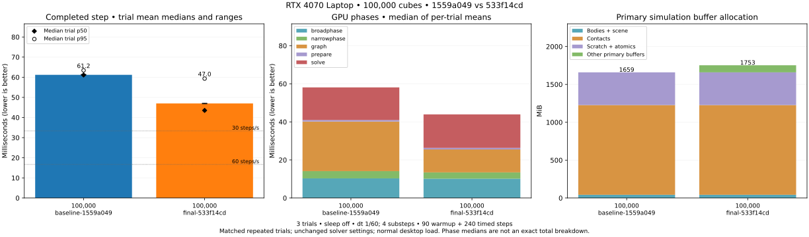

[Machine-readable comparison](benchmarks/rtx4070-tiled-100k-2026-09-24.json).
Local raw evidence is in `artifacts/dispatch-scaling/final-100k/`, including
per-step timings, power telemetry, binary hashes and the exact runner copies.


The full sweep uses three fresh-world trials per count/path, eight CPU workers,
unchanged global solver settings and normal desktop load. No trials were removed
for background load. Shading shows all trial ranges; small-count frame cadence
varies substantially, so use the p50/p95 plot alongside average rates. Both apps
render at 2040×1148. AC status, clocks, temperature and power snapshots are retained;
these are laptop operating conditions, not a fixed-power GPU measurement. Other
GPUs require the same benchmark; nominal FLOPS alone cannot predict these limits.

| Cubes | CPU / GPU physics steps/s | CPU / GPU Sokol FPS | CPU / GPU direct FPS |
|---:|---:|---:|---:|
| 15,000 | 122.56 / 90.47 | 64.78 / 64.65 | 100.36 / 125.53 |
| 20,000 | 86.20 / 92.43 | 46.31 / 56.65 | 75.61 / 96.60 |
| 30,000 | 49.70 / 64.92 | 27.23 / 41.01 | 43.61 / 69.00 |
| 50,000 | 24.98 / 39.85 | 14.50 / 25.45 | 23.80 / 39.80 |
| 60,000 | 19.86 / 34.62 | 11.57 / 21.58 | 18.64 / 33.23 |
| 100,000 | 10.84 / 20.68 | — / 12.87 | 10.31 / 20.29 |
| 150,000 | 6.81 / 13.02 | — / 8.73 | 6.43 / 12.96 |
| 200,000 | — / 9.80 | — / — | — / 9.70 |

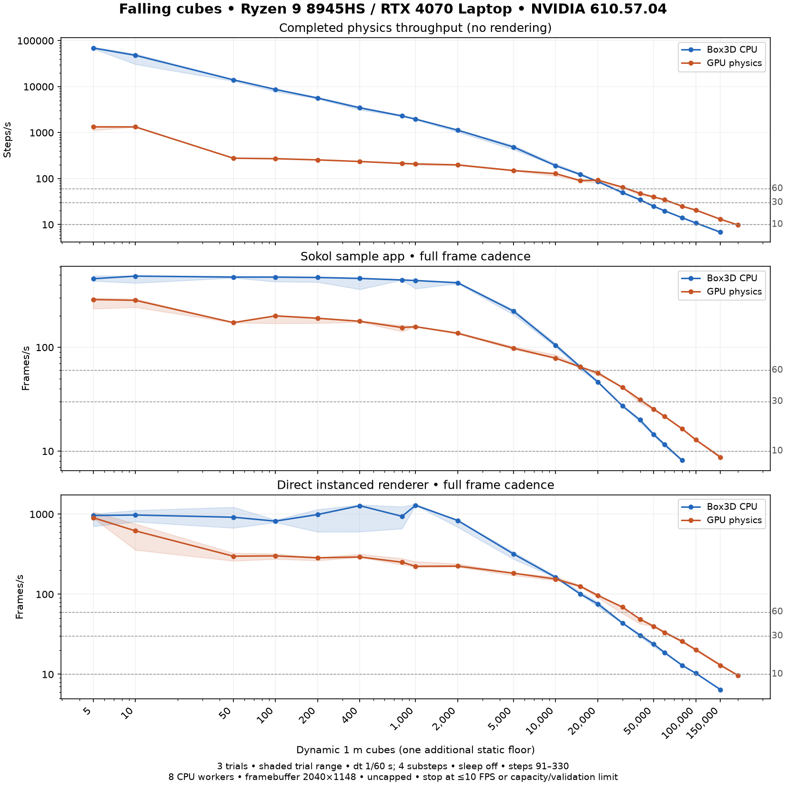

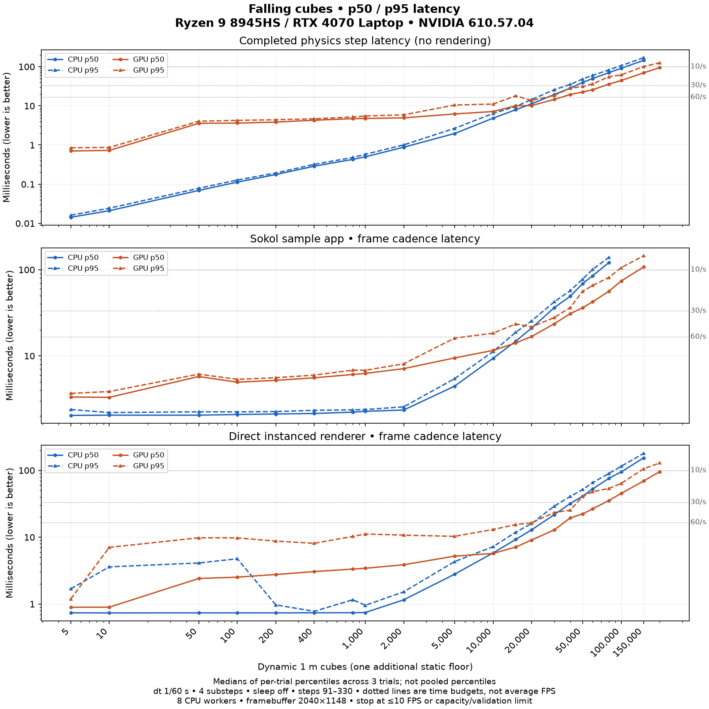

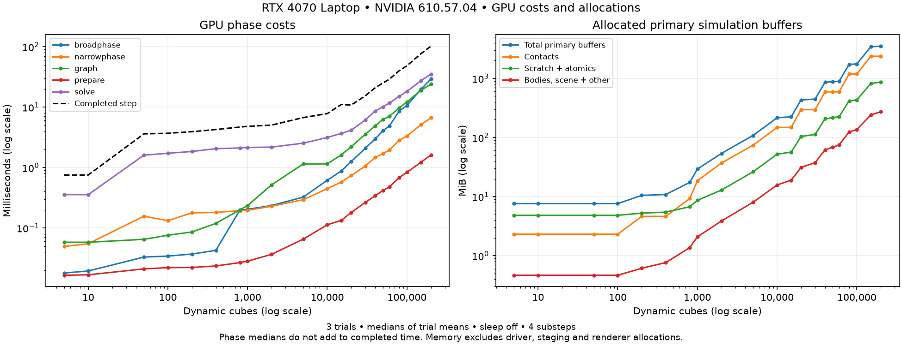

Thresholds are **last sampled count above → first at or below** the average rate.
They are brackets, not interpolated capacities or p95 guarantees. For example,
60,000 cubes average 33.23 FPS in the direct GPU renderer; that does not imply
that every frame meets a 30 FPS budget.

| Path | 60 steps/s or FPS | 30 steps/s or FPS | 10 steps/s or FPS |
|---|---:|---:|---:|
| physics-cpu | 20,000 → 30,000 | 40,000 → 50,000 | 100,000 → 150,000 |
| physics-gpu | 30,000 → 40,000 | 60,000 → 80,000 | 150,000 → 200,000 |
| sokol-cpu | 15,000 → 20,000 | 20,000 → 30,000 | 60,000 → 80,000 |
| sokol-gpu | 15,000 → 20,000 | 40,000 → 50,000 | 100,000 → 150,000 |
| direct-cpu | 20,000 → 30,000 | 40,000 → 50,000 | 100,000 → 150,000 |
| direct-gpu | 30,000 → 40,000 | 60,000 → 80,000 | 150,000 → 200,000 |

[Full data and trial ranges](benchmarks/rtx4070-tiled-scaling-2026-09-24.json)
· [Latency table](benchmarks/rtx4070-tiled-scaling-2026-09-24-timings.md)
· [Phase and memory data](benchmarks/rtx4070-tiled-resources-2026-09-24.json)
· [Numerical and source audit](benchmarks/rtx4070-tiled-audit-2026-09-24.json)
· [Raw results, tests, source patches and reproduction scripts](benchmarks/rtx4070-tiled-scaling-2026-09-24-raw.tar.gz)
· [Archive SHA-256](benchmarks/rtx4070-tiled-scaling-2026-09-24-raw.tar.gz.sha256)

Production physics now uses shared Rust/WGSL tiled indexing in direct, indirect
and native cached dispatches, retaining the existing 1D layout below the boundary.
Padded radix workgroups are bounded, strided kernels cover the full grid, and the
component solver retains its existing 2D layout. Two host tests pass; an NVIDIA
fixture verifies exactly-once writes and untouched padding at 0, 1, 65,535, 65,536
and 65,537 workgroups across all four dispatch modes (20 cases). A production
lifecycle fixture with 131,075 shapes also passes with native command caches and
full replay enabled and disabled, covering callbacks, contact events, deletion,
remapping and slot reuse. Reproduce with
`./scripts/build-native-cache.sh test --release --lib dispatch -- --test-threads=1`.
The final three 200,000-cube physics trials pass capacity-loss, finite-position
and ground-escape checks with 410,745 live contacts and all 200,000 dynamic bodies
awake after 330 steps. Median trial p50/p95 are **94.70/125.47 ms**; primary
simulation buffers occupy **3,674,669,472 bytes (3.42 GiB)**. Each GPU physics and
direct-renderer trial falls below 10/s at this count. This is the measured FPS
stopping point, not a hard body-count or VRAM ceiling. Sokol reaches its 10 FPS
stop at 150,000 cubes; it is not extrapolated to 200,000. The earlier, slower
post-tiling diagnostic is preserved in the raw archive.

Contact clearing now tracks a monotonic high-water mark of allocated contact
slots, including mesh patches, and preserves it across buffer growth. It clears
that dirty range rather than reading every reserved contact slot; retirement does
not shrink the range, so old event keys are still cleared. Unused history starts
empty, and pair producers overwrite their live prefix without a capacity-wide
fill. Convex free-list construction also scans only the previous slot high-water
mark plus new root demand, selecting the same lowest free slots; mesh worlds keep
the full pool for extra child patches. A focused alternating convex/mesh fixture
checks this ordering and the retained mesh capacity. The final native-cache
library suite passes all 267 tests on NVIDIA, with both Vulkan drivers visible
for the cross-adapter lifetime test. Focused graph-cache opt-out and native-cache
opt-out lifecycle checks also pass. The repeated 100,000-cube comparison above includes these changes.
[Validation record](benchmarks/rtx4070-tiled-validation-2026-09-24.json) lists
the checked cases, native interaction results and source log hashes.

The `falling-cubes` workload compares real Box3D CPU physics with this GPU engine
in three paths: completed physics steps without rendering, the Sokol sample app,
and the direct Rust instanced renderer. Each CPU/GPU pair uses the same scene,
time step and renderer. The direct renderer reads GPU body buffers without the
sample app's CPU pose mirror and debug-draw construction. Its CPU counterpart
runs independent Box3D physics and uploads its own transforms.

The fixture uses 1 m cubes, one floor and up to ten layers. Layer spacing is
1.25 m with alternating ±0.125 m offsets; starting heights are 6–17.25 m. Counts
are dynamic cubes, excluding the floor. Gravity is −10 m/s², dt is 1/60 s with
four substeps, default materials, and sleeping is disabled. Measurements cover
steps 91–330 (1.5–5.5 simulated seconds), including landing and pile settling.
This measures an awake falling pile, not continuous spawning or sleeping-world
performance. The C viewers/oracle share a scene header; the Rust fixture uses
exact binary-fraction coordinates, checked against the CPU viewer at startup.

Benchmark windows ignore interactive key/mouse controls; normal viewers retain
them. The sweep runs three trials per path/count, reversing path order on alternate
trials. FPS is the reciprocal of the median **trial mean** frame/step time;
p50 and p95 milliseconds and trial ranges are retained. Standalone `--bench`
files leave the legacy `cpu_win_validated` flag false; CPU crossover claims here
come from the matched multi-path, three-trial sweep. App timings use full
frame cadence, including presentation and a final device drain in the direct
viewer. GPU physics timings wait for completion. Startup, allocation and shader
loading occur before the timed window. Sokol's physics submission time alone is
not completed GPU simulation time. Cameras frame the whole workload, with each
viewer's own camera, lighting, UI and shading; this is an application comparison,
not an isolated renderer microbenchmark.

The following real viewer captures use 1,000 cubes, four substeps and sleeping
disabled on the NVIDIA GPU, both at 2040×1148. They were captured separately,
outside timing runs, at different simulation steps. Sokol includes its debug UI;
the direct renderer uses its own camera and shading. The on-screen timing in the
Sokol preview is illustrative and is not a benchmark result.

| Sokol sample app | Direct instanced renderer |
|---|---|
| 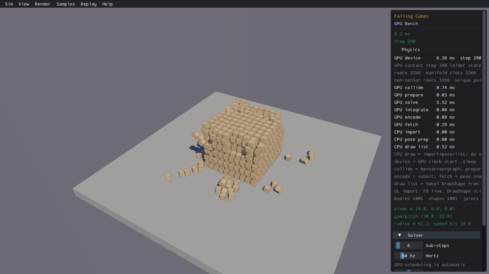 | 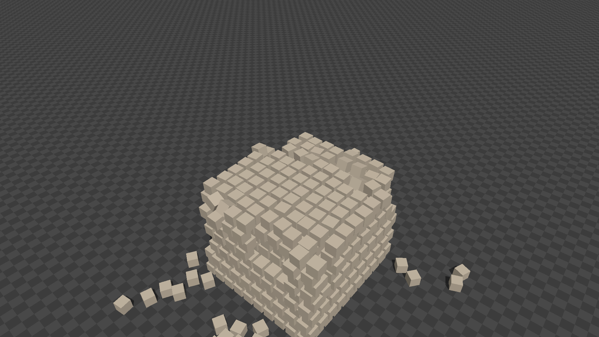 |

Each path stops independently at ≤10 FPS, invalid results, or a real capacity
limit. The default count schedule extends to 1,000,000 cubes, with each path
stopping at its own measured threshold or validation limit. Physics and the direct renderer use full-width
shape pairs and can test beyond 65,535 dynamic cubes, subject to device capacity
and validation. Native GPU metadata and CPU/GPU identity mappings use per-world
chunk tables. Both Sokol paths reserve at least `GPU_BENCH_CUBES + 1` debug
shapes and opaque instances per stream, then verify that all cubes plus the floor
reach each frame's renderer upload. `GPU_SAMPLES_SHAPE_CAPACITY` sets an explicit
startup reservation for other scenes; the ordinary default is 65,536. The pool
keeps stable pointers for the app lifetime. Transparent-stream limits are unchanged.
Falling Cubes fixes its draw distance at 1,000 m; the harness records saved renderer
settings and rejects changes to them during a sweep. Dropped
pairs/contacts, invalid bodies,
incomplete windows and mismatched framebuffers invalidate a measurement. The
physics/direct GPU paths check final completed state; Sokol's asynchronous
contact telemetry is checked throughout. Thresholds are brackets between tested
counts, not interpolated capacities or guarantees for other scenes.

Build before measuring, so compiler work does not compete with the benchmark:

```sh
# From experiments/gpu-physics, on the supported Linux native-cache path:
python3 scripts/run-native-samples.py cpu --build-only
python3 scripts/run-native-samples.py gpu --build-only
./scripts/build-native-cache.sh build --release
cmake --build oracle/build --target box3d_oracle -j 6
python3 scripts/check-viewer-cpu.py

# Real desktop display; these driver overrides match the measured NVIDIA laptop.
export __NV_PRIME_RENDER_OFFLOAD=1
export __GLX_VENDOR_LIBRARY_NAME=nvidia
export VK_DRIVER_FILES=/usr/share/vulkan/icd.d/nvidia_icd.json
python3 scripts/bench-falling-cubes.py artifacts/falling-cubes/my-machine \
  --adapter nvidia --gpu-solver global --timeout 900
# Plotting alone requires matplotlib; measurement uses the Python standard library.
python3 scripts/plot-falling-cubes.py artifacts/falling-cubes/my-machine \
  benchmarks/my-machine --title 'Exact CPU / GPU / driver'
python3 scripts/plot-falling-resources.py artifacts/falling-cubes/my-machine \
  benchmarks/my-machine-resources --title 'Exact GPU / driver'
```

Archived measurements through `a34c065b` include a quadratic CPU setup path:
first-shape bounds updates scan every shape in the world. The current implementation
keeps each body's live shape slots in creation order and uses them for bounds and
mass recomputation. Compound proxies and deletion remain part of that ownership
list. The completed startup qualification below measures these costs separately;
published steady-state charts exclude scene creation and warmup.

`GPU_PHYSICS_STARTUP_BENCH=/absolute/output.json` selects an initialization-only
measurement in the Rust executable, separating device, scene and GPU preparation
times without running a CPU oracle or physics steps. Its first-frame field is null.
`GPU_PHYSICS_STARTUP_REPORT=/absolute/output.json` records the first presented
scene frame and loading-frame count in either viewer. Direct timing begins before
window creation; Sokol timing begins at its initialization callback, before renderer
setup. Sokol reports shared physics-device initialization separately from scene
construction. These boundaries must be retained when comparing preserved builds.
Set `GPU_PHYSICS_STARTUP_EXIT=1` with the direct demo's report option to exit after
the first scene frame (not supported for timeline recording). The Sokol equivalent
is a one-frame `--bench-json` run with `--warmup 0 --timed 1`.
`scripts/bench-startup.py` runs paired before/after binaries with private persistent
caches and records phase timings, hardware, cache inventories and raw-file hashes.
`scripts/plot-startup.py INPUT_DIRECTORY OUTPUT_PREFIX --title 'GPU / date'`
requires the complete repeated grid before producing scene-scaling and startup
latency charts; `--validate-only` checks the evidence without plotting.
The **2026-09-25 RTX 4070 Laptop GPU / Ryzen 9 8945HS** startup comparison contains all 96 launches:
four cube counts, two renderers, baseline `a34c065b` versus candidate `5385a33f`,
cold/warm persistent caches and three alternating trials. At 200,000 cubes:

| Warm-cache median | Direct baseline → candidate | Sokol baseline → candidate |
|---|---:|---:|
| Scene creation | 89.68 s → **86.9 ms** (1,032×) | 96.79 s → **329.6 ms** (294×) |
| First scene frame | 93.83 s → **1.86 s** | 98.87 s → **2.22 s** |
| First loading frame | None → **214 ms** | 97.26 s → **25 ms** |

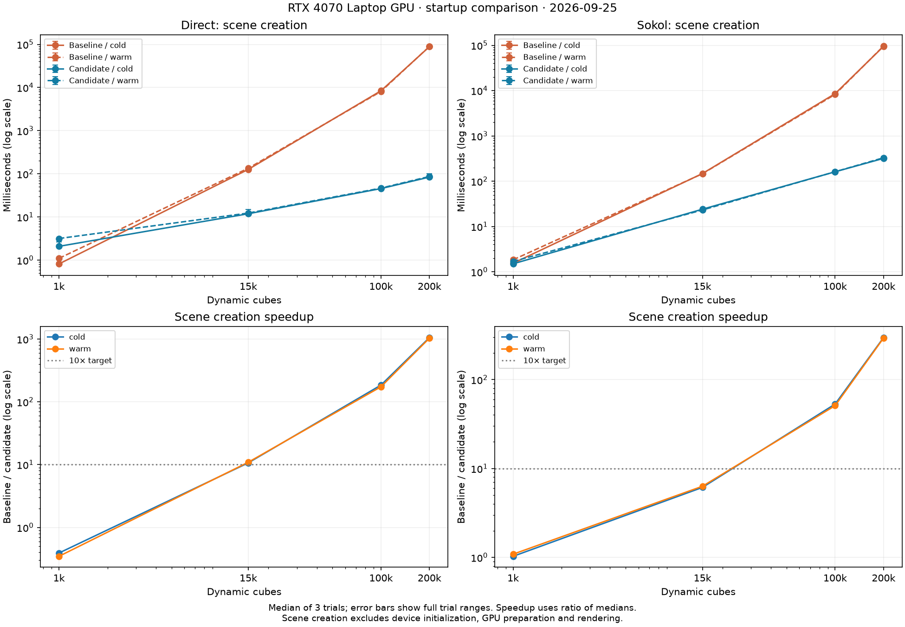

Candidate creation scales approximately linearly across the larger counts:
100k → 200k takes 46.7 → 86.9 ms in the direct viewer and 161.9 → 329.6 ms in
Sokol. Small direct scenes carry extra overhead: at 1k cubes the warm median rose
from 1.10 to 3.17 ms. The improvement removes the large-world scan, not every
allocation or per-shape setup cost.

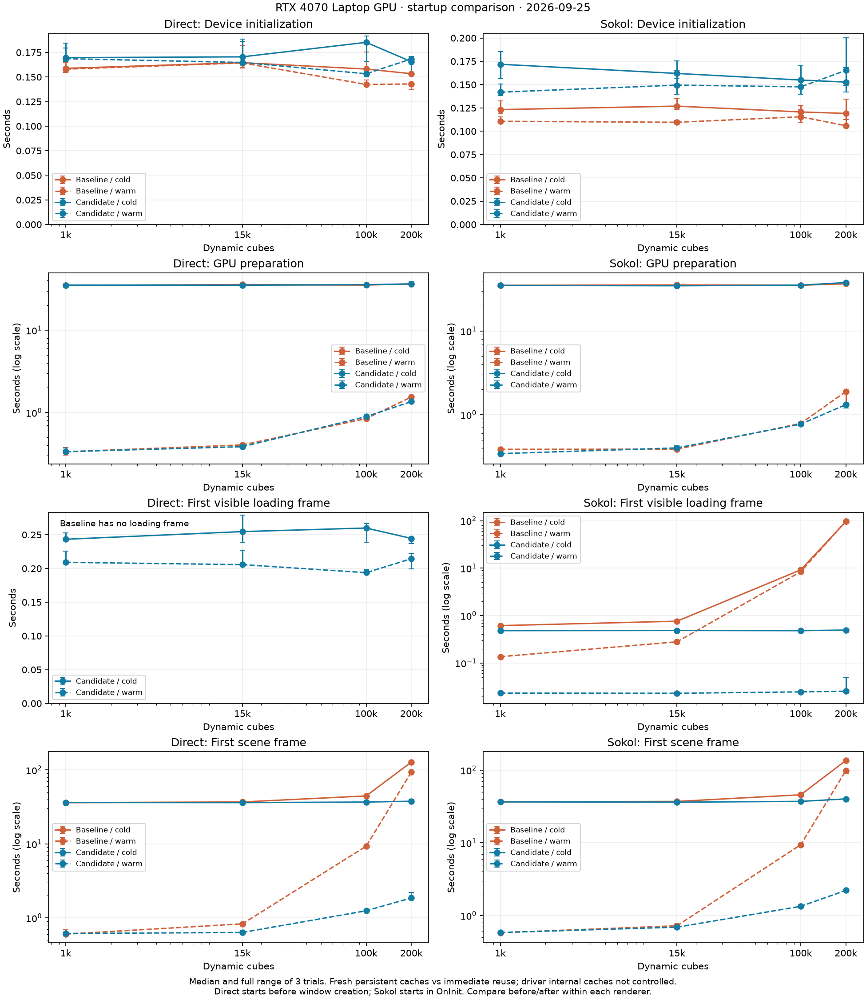

Cold-cache GPU preparation remains about **36–38 seconds** at 200k cubes. The
candidate shows loading after 245 ms (direct) or 495 ms (Sokol), and the first
scene after 37.76 or 40.19 seconds. This change does not eliminate driver shader
compilation. Cold runs use fresh application, XDG and NVIDIA disk-cache paths;
driver-internal caches are not claimed flushed. Before/after framebuffer sizes
match within each renderer: direct 2048×1152, Sokol 2040×1148. Compare each renderer
against its own baseline rather than treating these as identical rendering paths.

Baseline instrumentation adds phase timers and compiles the direct viewer's lazy
collision pipeline on its original UI thread before the first frame, matching
the candidate's preparation scope without dispatching a physics step. The
[summary JSON](benchmarks/rtx4070-startup-2026-09-25.json) retains trial values,
source manifest, raw hashes and the scheduler-pause annotation from the separate
loading-video capture. That pause affects one process-wall duration, not the
internal phase timers used here. The final native-cache library suite passes
**270/270**, and seven focused ownership, mass,
compound and replacement tests pass with pipeline/command caches disabled.
Runtime lifecycle testing also found and fixed a Sokol character-restart crash:
cached renderer meshes must be released on the host thread before worker-side
world destruction. Character restart/switch/return, mouse capture and clean
shutdown now pass. This follow-up leaves initial scene construction unchanged;
the startup charts retain the frozen `5385a33f` binaries.

Steady-state qualification uses 90 warmup + 240 timed steps, three alternating
before/after trials per case, eight CPU workers and the global GPU solver. Values
below are medians of trial means; physics measures completed steps, while renderer
rows include the full application frame. Normal desktop load was allowed.

| Workload | Cubes | Baseline → candidate | Change in time |
|---|---:|---:|---:|
| Completed GPU physics | 1,000 | 4.742 → 4.978 ms | +5.0% |
| Direct application | 1,000 | 5.185 → 4.626 ms | −10.8% |
| Sokol application | 1,000 | 6.488 → 6.551 ms | +1.0% |
| Completed GPU physics | 100,000 | 46.030 → 46.261 ms | +0.5% |
| Direct application | 100,000 | 45.674 → 45.613 ms | −0.1% |
| Sokol application | 100,000 | 74.069 → 72.556 ms | −2.0% |

The initial small headless slowdown did not reproduce in five additional alternating
pairs: 4.910 → 4.828 ms (−1.7%), with overlapping trial ranges. Both datasets and
their ranges remain in the [steady-state evidence](benchmarks/rtx4070-startup-steady-2026-09-25.json).
These runs show no consistent steady-state regression; they do not establish a
steady-state speedup from the startup changes. The CPU-reference viewer also passes
a 95-step functionality check. All 19 affected GPU scenes were recorded for 300
frames each under `2026-09-25-startup` in the local comparison grid. Their **5,700
decoded frames match the exact baseline GPU recordings**. The independent Box3D
CPU column remains first; existing CPU/GPU pile and joint-chain differences also
appear in that baseline. The [portable raw evidence archive](benchmarks/rtx4070-startup-2026-09-25-raw.tar.gz)
includes reproduction instructions, frozen sources, logs and validation helpers
([SHA-256](benchmarks/rtx4070-startup-2026-09-25-raw.tar.gz.sha256)).
Extraction into a fresh directory verified all 1,095 payload hashes and independently
revalidated the 96 startup launches, 36 steady-state trials and 10 anomaly rechecks.

Headless physics trials also
run a CPU reference and a separate host-mirror pass, so their wall-clock duration
is longer than the headline GPU measurement window. Let benchmark windows close
automatically: closing one early leaves an incomplete trial that validation rejects.

`--require-idle` checks background load before each trial and stops without losing
completed trials if CPU use exceeds 15% or NVIDIA GPU use exceeds 10%. A busy
two-second reading is confirmed over a full ten-second CPU averaging window,
so a brief spike does not abort the sweep. GPU readings retain the 10% ceiling.
Each trial retains its idle-check evidence, and atomic checkpoint writes preserve completed
trials and terminal failures across interruption (`scripts/check-falling-resume.py`
exercises this recovery). Repeat the same command with `--resume` after interruption; it requires unchanged binaries, settings
and environment. The optional idle gate may be changed when resuming; the resume
history and individual trials record that policy. Without `--require-idle`, runs
proceed under normal desktop load. Use the repeated-trial ranges and saved load
telemetry to investigate unusually inconsistent results, retaining all valid trials.

The broadphase follow-up reuses part of the former packed-pair-set allocation for a spatial hash that
scales with reserved pair capacity. Small reservations retain the original table;
contact identities and buffer offsets stay unchanged. The completed physics
comparison against `49b024f5` uses three alternating before/after trials on the
RTX 4070 Laptop under normal desktop load, with profiling timestamps disabled.
At 200,000 cubes, median trial mean step time falls from 105.77 to 94.23 ms
(12.3% higher throughput), and broadphase time falls from 31.11 to 19.14 ms
(38.5% lower). Primary simulation buffers remain 3.42 GiB. Trial mean ranges are
101.22–107.74 ms before and 92.45–103.10 ms after; these overlap, so the headline
is a measured median gain rather than a guarantee for every run.

At 100,000 cubes, throughput increases 3.8% and broadphase time falls 22.0%.
The 5/1,000/15,000-cube checks have median throughput changes of −0.1%/−0.8%/−2.9%,
respectively, with overlapping trial ranges; all valid trials are retained.
The 268-test native-cache suite and focused cache-off coverage/lifecycle checks
pass. All 24 matched application trials also pass at a 2040×1148 framebuffer:
direct-renderer median FPS changes from 20.15 to 21.06 at 100,000 cubes (+4.5%)
and 8.55 to 9.58 at 200,000 (+12.1%); Sokol changes from 12.47 to 13.01 (+4.3%)
and 6.39 to 6.90 (+8.0%), respectively. These are before/after comparisons within
each renderer.

Measurements were collected on September 24–25, 2026 on AC power with the
Ryzen 9 8945HS and NVIDIA driver 610.57.04. The filenames use the experiment's
start date. All runs use 90 warmup and 240 measured steps, four substeps, sleep
disabled and the same global solver/cache settings. Power and load snapshots
are retained; clocks and desktop load were not held fixed. These results do not
establish scaling on another GPU or a general VRAM capacity ceiling.

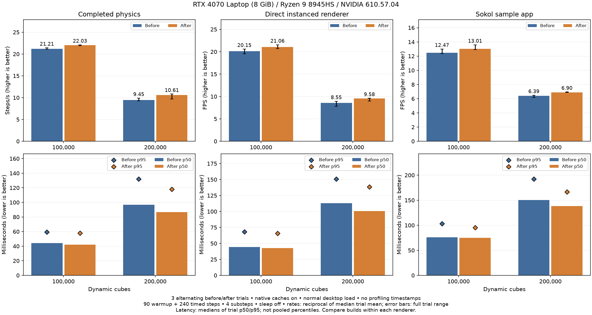

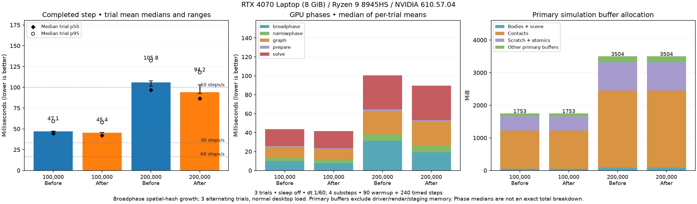

The separate three-trial diagnostic profiles identify dynamic/retained pair
traversal as the largest avoidable broadphase cost. At 200,000 cubes its median
cost falls from about 19.91 to 10.47 ms. Radix sorting rises from about 8.19 to
10.51 ms in these instrumented runs, becoming comparable to pair traversal;
clearing and insertion remain small. Profiling adds timestamp commands, so use
the uninstrumented comparison above for headline gains. Graph construction and
solving remain substantial costs outside broadphase.

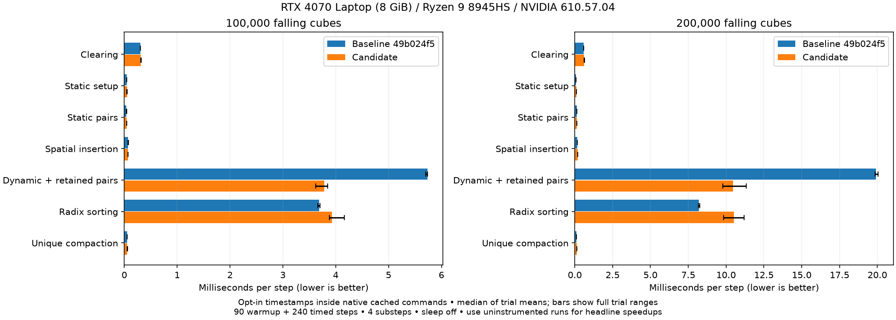

All 19 scenes were recorded for 300 frames in
`2026-09-25-spatial-hash-growth`, with the Box3D CPU oracle first in the local
comparison grid. Sampled visual review at frames 120 and 299 found no new gross
scene regression against the previous GPU recordings; this supplements the
correctness tests and does not assert CPU/GPU trajectory equivalence.

The [raw evidence archive](benchmarks/rtx4070-broadphase-2026-09-24-raw.tar.gz)
([SHA-256](benchmarks/rtx4070-broadphase-2026-09-24-raw.tar.gz.sha256)) preserves
raw samples, manifests, hardware/power observations, source and binary identities,
validation logs, interrupted/failed attempts and reproduction instructions.
Videos remain in the local comparison grid; their hashes and manifests are archived.
The [measurement audit](benchmarks/rtx4070-broadphase-measurement-audit-2026-09-24.json)
includes all 30 physics trials, 24 renderer trials and 12 diagnostic profiles.
Earlier charts and evidence remain unchanged.

For before/after completed-physics comparisons, preserve both executables and run
`scripts/compare-falling-binaries.py <global-solver-manifest.json> <new-output-dir>
--binary before=<preserved-path> --binary after=<new-path> --counts 100000 --trials 3`.
It uses one environment and measurement window, alternates executable order,
checks binary hashes, and retains raw samples, phase costs, allocations, power
snapshots and failed trials. It supplements the full CPU/renderer sweep above.
After an interruption, repeat the comparison command with `--resume`. It verifies
the original settings, binary order/hashes and completed raw files, skips completed
trials, and preserves interrupted logs and prior trial records under
`resume-history/` before retrying unfinished trials.
For paired application measurements, `compare-falling-renderers.py <baseline-manifest>
<output-dir> --gpu-binary <candidate-direct> --sokol-gpu-binary <candidate-sokol>`
alternates both renderers at 100k/200k across three trials, retaining raw files,
executable hashes, framebuffers and rendering settings.
Its `--resume` option verifies completed raw files and settings, restores the
framebuffer/render-setting checks, and archives incomplete attempts before retrying.
`plot-falling-comparison.py <physics-comparison-dir> <renderer-comparison-dir>
<output-prefix> --title "Exact CPU / GPU / driver"` shows the repeated throughput
and p50/p95 latency comparisons together; phase and memory plots remain separate.

Use `bench-falling-cubes.py --profile-broadphase --modes physics-gpu` with
counts of at least 1,000 for this diagnostic (the runner records the flag and
rejects missing stage samples). For native Vulkan broadphase diagnosis, `GPU_PHYSICS_PROFILE_BROADPHASE=1`
with `GPU_PHYSICS_NATIVE_RADIX_CACHE=2` adds timestamps inside the cached
large-world broadphase. Completed-step raw runs include `broadphase_profile`
with named per-step timings for clearing, static setup, static pairs, spatial
insertion, dynamic/retained pairs, radix sorting and unique compaction. Transfer
and dispatch-argument preparation are included in the preceding stage. The
small-scene pair-matrix path is not instrumented. This is diagnostic timing;
leave the flag unset for headline before/after throughput and renderer trials,
and measure its overhead before interpreting absolute substage costs.
`plot-broadphase-stages.py <before-profile-dir> <after-profile-dir> <output-prefix>
--title "Exact GPU / driver"` compares the diagnostic stages after three trials
per count; it checks matching environments and retains raw-file hashes and ranges.

The small-scene investigation profiles 5/100/1,000/2,000/5,000/10,000 active
bodies in both falling piles and independent two-box groups on the RTX 4070 Laptop.
The baseline's global schedule jumps from 13 solver dispatches at five falling
cubes to 325 at 100. At 1,000 falling cubes the diagnostic host step call costs
about 1.60 ms and the completion wait about 3.26 ms. That wait includes unfinished
GPU work and status/timestamp harvesting; it is not pure synchronization overhead.
The chart keeps host wall time and GPU timestamps separate. These are diagnostic
runs (one falling-pile trial and two independent-group trials per count), not the
repeated matched performance qualification.

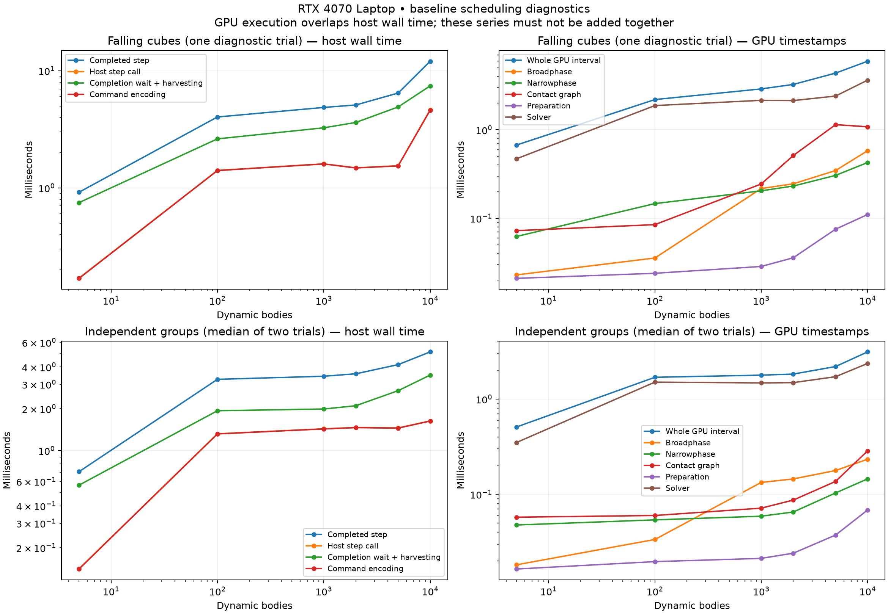

[Diagnostic data and raw hashes](benchmarks/rtx4070-small-scene-profile-2026-09-25.json).

The same benchmark runner accepts `--scene mixed-stacks` for physics-only
comparisons of independent two-box groups on overlapping static grounds. Both
engines use the existing matching fixture; counts refer to dynamic bodies (two
additional static bodies). `--gpu-color-prefix auto` measures the existing adaptive
color grouping; the historical default is `20`. `--global-replay 0|1` explicitly
selects the global replay path and records the choice in the manifest.

For diagnostic completed-step runs, `GPU_PHYSICS_PROFILE_HOST=1` adds
`raw_runs[].host_profile.step_call_ms` and `completion_wait_ms`. These split host
wall time at submission: the first includes preparation/submission, and the second
includes remaining GPU execution plus status/timestamp harvesting. Neither copies
poses to the CPU. GPU execution overlaps host work, so do not add GPU phase times
to these wall-time values. Keep these instrumented runs separate from headline
measurements. When `GPU_PHYSICS_FULL_REPLAY=1`, eligible global-solver worlds also reuse their
recorded physics commands. `GPU_PHYSICS_GLOBAL_REPLAY=0` opts out for comparison.
The earlier small-scene physics qualification on 2026-09-25 contains 153 runs: three
alternating baseline/candidate/CPU trials per scene and count, each with 90 warmup
and 240 timed steps, four substeps, sleeping disabled, and eight CPU workers.
Hardware is the RTX 4070 Laptop / Ryzen 9 8945HS with NVIDIA 610.57.04 on Linux
Vulkan, under normal desktop load. Baseline `73373dfb` uses global prefix 20;
the candidate combines global command replay with the existing adaptive prefix
(`auto`). Both retain ordinary GPU timestamps; extra host/broadphase profiling is
off. Completed steps exclude the separate fresh-world CPU pose-mirror pass.

| Scene | Bodies | Baseline GPU ms | Candidate GPU ms | CPU ms | GPU speedup |
| --- | ---: | ---: | ---: | ---: | ---: |
| Falling pile | 1,000 | 4.971 | 2.682 | 0.494 | 1.85× |
| Falling pile | 2,000 | 5.176 | 3.296 | 0.812 | 1.57× |
| Falling pile | 5,000 | 6.489 | 4.770 | 1.777 | 1.36× |
| Independent groups | 1,000 | 3.478 | 1.389 | 0.284 | 2.50× |
| Independent groups | 2,000 | 3.581 | 1.443 | 0.598 | 2.48× |
| Independent groups | 5,000 | 4.173 | 1.715 | 1.106 | 2.43× |

Values are medians of three trial means. The 2× target is met for independent
groups at 1,000–5,000 bodies, but not connected falling piles. The CPU remains
faster at these counts. In the falling-pile sweep, the first measured GPU win is
20,000 bodies: candidate trial means span 9.086–9.356 ms versus CPU
9.608–10.748 ms. At 30,000 the separation is clearer: 13.656–13.947 ms versus
17.590–19.248 ms. These are workload-specific measured points, not a universal
crossover threshold.

The ordinary phase timestamps help locate the remaining cost. At 1,000 falling
cubes, median trial p50 command encoding falls from 1.640 to 0.129 ms and GPU
solving from 2.123 to 1.636 ms; graph construction stays near 0.242 ms. At 5,000,
encoding falls from 1.543 to 0.202 ms, but graph construction still takes 1.239 ms
and solving 1.962 ms. These overlapping host/device measures are not an additive
breakdown of completed-step time. The result points toward GPU graph and solver
scheduling as the next optimization area, rather than more command-recording
reuse alone. CPU pose mirroring is excluded from the headline step and measured
in a separate fresh-world pass; its median must not be subtracted as an exact
readback cost.

All paired 100k/200k trials improved. Median GPU time changes from 46.505 to
45.726 ms at 100k (trial ranges overlap), and from 95.680 to 92.141 ms at 200k.
Primary buffer allocation is unchanged at 1,837,715,104 and 3,674,669,472 bytes;
this excludes other VRAM allocations. Five falling cubes show a slightly worse
median, 0.740 to 0.791 ms, with overlapping trial ranges; the chart retains it.

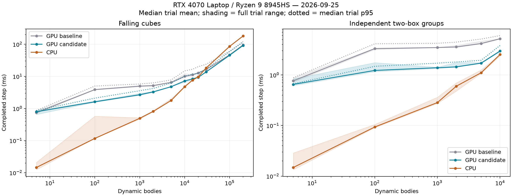

[Completed steps per second](benchmarks/rtx4070-small-scene-physics-2026-09-25-throughput.png),
[p50/p95 latency](benchmarks/rtx4070-small-scene-physics-2026-09-25-percentiles.png),
and [validated results with raw hashes](benchmarks/rtx4070-small-scene-physics-2026-09-25.json).
The throughput figure above is physics-only. The separate full-app qualification
contains 162 renderer runs, using the same trial order, warmup, timed frames and
physics configuration. Both viewers use actual 1280×720 framebuffers, NVIDIA
hardware rendering and unpaced presentation on an isolated Xvfb display. Sokol
render settings are matched across variants, including draw distance 1,000.
These FPS figures include application/render/presentation overhead and describe
this display setup; they should not be treated as native desktop FPS predictions.

| Renderer | Bodies | Baseline GPU FPS | Candidate GPU FPS | CPU FPS |
| --- | ---: | ---: | ---: | ---: |
| Direct | 1,000 | 29.6 | 32.0 | 37.2 |
| Direct | 5,000 | 28.0 | 30.1 | 32.8 |
| Direct | 10,000 | 28.6 | 30.6 | 29.2 |
| Direct | 100,000 | 15.3 | 15.7 | 7.7 |
| Direct | 200,000 | 9.1 | 9.2 | 4.0 |
| Sokol | 1,000 | 25.5 | 27.5 | 33.4 |
| Sokol | 5,000 | 24.5 | 26.0 | 27.6 |
| Sokol | 10,000 | 24.9 | 26.2 | 23.1 |
| Sokol | 100,000 | 10.5 | 10.7 | 4.7 |
| Sokol | 200,000 | 6.4 | 6.5 | 2.4 |

At 1,000–5,000 bodies, full-app improvements are about 6–10%, smaller than the
physics-only gains. Both viewers first show a measured GPU win at 10,000 bodies,
with separated trial ranges. At 100k/200k, candidate median FPS improves modestly
in both viewers; physics-only large-scene comparisons are reported above. Five
bodies in Sokol show a 2% median regression, retained in the data. No configuration
in this isolated-display sweep reaches 60 FPS, including the CPU at five bodies;
that is an application/display result, not a 60 Hz physics capacity limit.

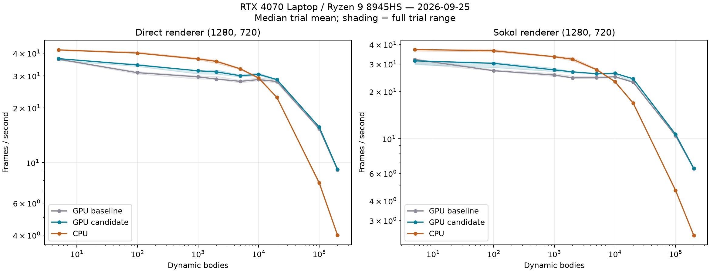

[Frame time and trial ranges](benchmarks/rtx4070-small-scene-renderers-2026-09-25-latency.png),
[frame p50/p95](benchmarks/rtx4070-small-scene-renderers-2026-09-25-percentiles.png),
and [validated renderer data and raw hashes](benchmarks/rtx4070-small-scene-renderers-2026-09-25.json).
Validation passed 272 native-cache library tests, including the two new global
replay long-state/reentry cases, plus five focused cache-off tests. Both long
replay fixtures compare complete states across 40 checkpoints over 1,000 steps,
including mutations, scheduling changes and capacity growth; worst replay-on/off
difference was zero. All 19 scenes were recorded for 300 frames before and after;
every decoded baseline/candidate frame matches. Representative CPU/before/after
frames were reviewed for every scene. Existing late CPU/GPU arrangement differences
in falling piles and joint chains remain; this is not a claim of exact CPU parity.

The [raw evidence archive](benchmarks/rtx4070-small-scene-2026-09-25-raw.tar.gz)
([SHA-256](benchmarks/rtx4070-small-scene-2026-09-25-raw.tar.gz.sha256)) contains trial
JSON/logs, binary identities, profiling pilots, correctness logs, scene manifests,
review sheets, source changes and reproduction scripts. It excludes executables,
caches and MP4s. Extract it into an empty directory and follow `REPRODUCE.md`;
`artifacts/small-scene-optimization/verify-evidence.py` in the original experiment
checks the archive checksum, all payload hashes and raw datasets from a fresh
extraction. Raw runtime git/source hashes describe the checkout at measurement
time; frozen executable SHA-256 identities establish which binary was measured.


The **connected-scene scheduling follow-up (2026-09-25)** compares baseline
`c46b81e2` with register-local grouped solving and density-selected graph memoization.
Both variants use the global solver, automatic color prefix and full command
replay. The workload, four substeps, 1/60 s timestep, disabled sleeping, eight CPU
workers, 90 warmup steps and 240 measured steps are unchanged. Results below are
medians of three alternating trial means under normal desktop load: 108 physics
trials and 72 representative renderer trials, on the same RTX 4070 Laptop / Ryzen
9 8945HS / NVIDIA 610.57.04 system. Earlier charts remain above as history.

| Falling cubes | Baseline GPU ms | Candidate GPU ms | CPU ms | GPU time reduction |
| ---: | ---: | ---: | ---: | ---: |
| 1,000 | 2.754 | 2.687 | 0.530 | 2.4% |
| 2,000 | 3.215 | 2.718 | 0.807 | 15.5% |
| 5,000 | 4.591 | 3.675 | 1.791 | 20.0% |
| 10,000 | 5.646 | 5.536 | 4.418 | 1.9% |
| 15,000 | 7.440 | 7.459 | 6.874 | -0.3% |
| 20,000 | 9.272 | 9.275 | 9.935 | 0.0% |
| 100,000 | 44.279 | 44.881 | 82.961 | -1.4% |
| 200,000 | 91.536 | 91.248 | 180.533 | 0.3% |

The **25% lower completed-step target at 1k–5k was not reached**. At 1k the
trial ranges overlap and one pair is slightly slower, so its small median gain
is not a reliable speedup claim. All paired 2k and 5k trials improve. CPU physics
remains faster throughout that small-scene range. The first measured falling-pile
GPU win is still 20k cubes (all GPU trial means below all CPU trial means); CPU
wins at 15k. This is a sampled, workload-specific crossover rather than a universal
body-count threshold.

Sparse groups show no consistent slowdown. At 200k, paired GPU time changes are
+0.01%, −0.75% and +0.38%: effectively unchanged within run variability. Primary
simulation-buffer allocation is unchanged at 1,837,715,104 bytes for 100k and
3,674,669,472 bytes for 200k, excluding rendering and other driver allocations.

The initial 100k pairs were all slower (+0.41% to +1.90%), so renderer qualification
was held while a balanced three-way probe compared baseline, solver-only checkpoint
and adaptive candidate. Follow-up adaptive changes were −0.25%, −1.65% and +0.15%.
Across all six pairs the median paired change is +0.28%; the direction is not stable.
We claim no reliable 100k speedup or slowdown. Both rounds are retained rather than
pooling only favorable trials. Matching contact/awake/dispatch counts and a native
shader-emitter comparison support the investigation: graph, broadphase and ordinary
solver entries emit identical SPIR-V; the changed entries are the three grouped
solvers and the density-hint publication pass. This does not guarantee zero cost
on every run or different hardware.

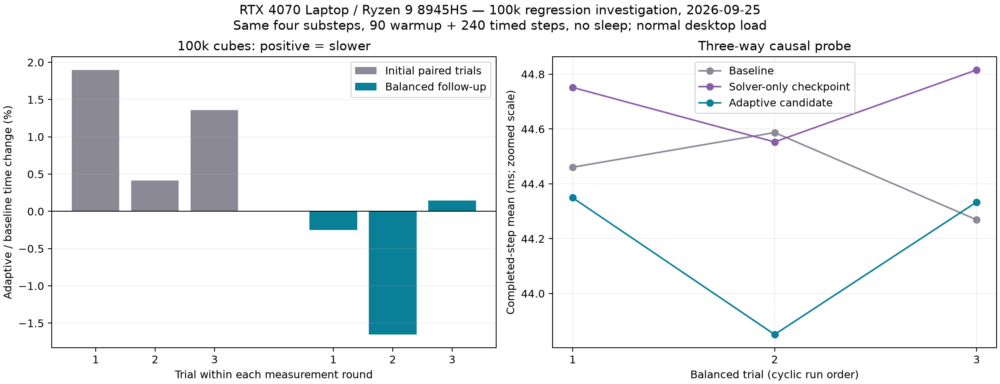

[Investigation data and raw hashes](benchmarks/rtx4070-connected-scheduling-large-check-2026-09-25.json).

At 5k cubes, median graph construction changes from 1.142 to 0.549 ms;
solving changes from 1.951 to 1.876 ms.
At 1k, solving alone still costs 1.544 ms.
Solver execution remains the largest measured GPU stage; this includes arithmetic,
memory access, sequential color dependencies and dispatch/barrier costs. Phase
timings alone do not separate those costs. This is not a hardware impossibility
proof. The next investigation should test fewer solver launches and better work
distribution while preserving contact ordering; increasing batch size or
hard-coding fewer parallel colors did not produce a reliable improvement in the retained pilots. GPU timestamp phases
must not be added to overlapping host wall-time measures.

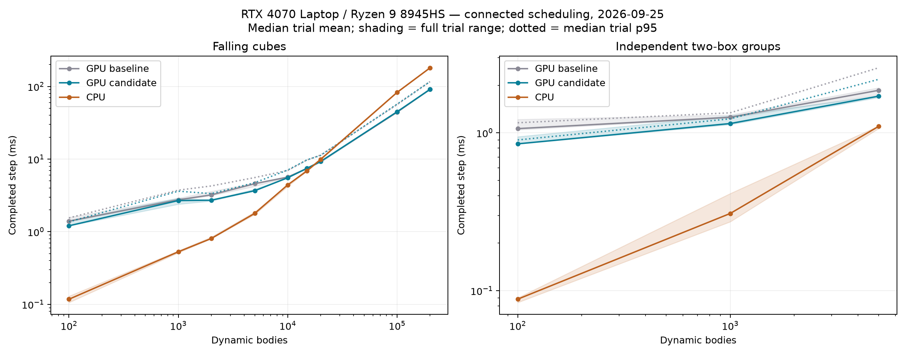

[Physics throughput](benchmarks/rtx4070-connected-scheduling-physics-2026-09-25-throughput.png),
[p50/p95 latency](benchmarks/rtx4070-connected-scheduling-physics-2026-09-25-percentiles.png),
[graph versus solver cost](benchmarks/rtx4070-connected-scheduling-physics-2026-09-25-phases.png),
and [validated data with raw hashes](benchmarks/rtx4070-connected-scheduling-physics-2026-09-25.json).

| Renderer | Cubes | Baseline GPU FPS | Candidate GPU FPS | CPU FPS |
| --- | ---: | ---: | ---: | ---: |
| Direct | 1,000 | 32.6 | 33.0 | 38.7 |
| Direct | 5,000 | 30.9 | 31.7 | 33.8 |
| Direct | 10,000 | 30.9 | 30.7 | 29.3 |
| Direct | 20,000 | 29.6 | 29.7 | 23.2 |
| Sokol | 1,000 | 27.6 | 27.8 | 33.6 |
| Sokol | 5,000 | 25.9 | 25.4 | 28.4 |
| Sokol | 10,000 | 26.5 | 26.7 | 23.5 |
| Sokol | 20,000 | 24.6 | 24.7 | 17.2 |

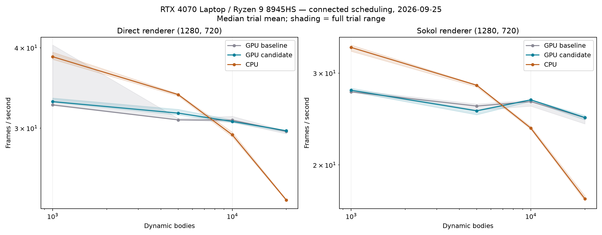

[Frame latency](benchmarks/rtx4070-connected-scheduling-renderers-2026-09-25-latency.png),
[frame p50/p95](benchmarks/rtx4070-connected-scheduling-renderers-2026-09-25-percentiles.png),
and [validated renderer data](benchmarks/rtx4070-connected-scheduling-renderers-2026-09-25.json).
These runs use matched 1280×720 viewports, NVIDIA hardware rendering, unpaced
presentation and the same isolated Xvfb setup as the previous qualification.
Full-app FPS includes rendering, application and display costs; it is separate
from completed physics steps/s and does not predict native desktop FPS exactly.

All 275 native-cache tests pass across two invocations: 274 in the NVIDIA-only
suite, plus the cross-adapter transfer test with both Vulkan drivers visible.
The initial missing-AMD-destination failure is retained as environment evidence.
Eight cache-disabled checks pass. Coverage includes graph path switches,
canonical slot/color order, merged/split contacts, spawning, destruction/slot reuse,
buffer growth, stale topology hints and 1,000-step replay state agreement.
All 19 affected recordings match the baseline across 300 decoded frames each;
the real Box3D CPU comparison column remains pinned.

The [raw evidence archive](benchmarks/rtx4070-connected-scheduling-2026-09-25-raw.tar.gz)
([SHA-256](benchmarks/rtx4070-connected-scheduling-2026-09-25-raw.tar.gz.sha256)) retains frozen binary
identities, source hashes/patch, raw trials, environments, test logs, recording
hashes and reproduction/plotting scripts. The
[earlier checkpoint archive](benchmarks/rtx4070-connected-scheduling-checkpoint-2026-09-25-raw.tar.gz)
remains available. Pilot and rejected-prototype results are diagnostic and are
not pooled with qualification trials.

The **solver writeback follow-up (2026-09-25)** compares baseline `0bbf5f63`
with impulse-only contact stores. The simulation, color order, dispatch count,
four substeps, 1/60 s timestep and disabled sleeping are unchanged. These are
medians of three alternating trial means on the RTX 4070 Laptop / Ryzen 9 8945HS,
with eight CPU workers, 90 warmup and 240 timed steps under normal desktop load.
The qualification contains 108 physics runs and 72 representative renderer runs.

| Falling cubes | Baseline GPU ms | Candidate GPU ms | CPU ms | GPU time reduction |
| --- | ---: | ---: | ---: | ---: |
| 100 | 1.198 | 1.397 | 0.128 | -16.6% |
| 1,000 | 2.746 | 2.568 | 0.489 | 6.5% |
| 2,000 | 2.942 | 2.715 | 0.786 | 7.7% |
| 5,000 | 3.916 | 3.857 | 2.143 | 1.5% |
| 10,000 | 7.035 | 6.422 | 4.663 | 8.7% |
| 15,000 | 7.982 | 7.027 | 7.877 | 12.0% |
| 20,000 | 9.677 | 8.475 | 10.033 | 12.4% |
| 100,000 | 43.833 | 39.148 | 82.927 | 10.7% |
| 200,000 | 90.329 | 83.157 | 183.469 | 7.9% |

The **20% completed-step target at both 2k and 5k was not reached**.
The requested approximate absolute targets were 2.17 ms at 2k and 2.94 ms at 5k.
Individual paired time changes (positive means slower) are 1,000: -6.5%, +3.2%, -11.2%; 2,000: -17.7%, -5.5%, +1.5%; 5,000: -0.6%, -2.1%, -1.5%.
The first sampled median GPU physics win moves from 20,000
cubes for the baseline to 15,000 for the candidate in this matched sweep.
At that candidate count, every GPU trial mean is below every CPU trial mean.
This is workload-specific, not a universal crossover threshold. Consult the raw
trial ranges rather than treating small median differences as guaranteed gains.

The 100-cube median is worse, with paired changes of +6.8%, +19.2% and
−1.5%. Small-scene timings vary; there is no claim of a universal speedup.
The sparse and large-scene paired time changes are retained explicitly:

- falling-cubes / 20,000: -12.43%, -10.86%, -15.91%
- falling-cubes / 100,000: -10.54%, -11.68%, -10.88%
- falling-cubes / 200,000: -7.39%, -8.07%, -7.34%
- mixed-stacks / 100: -19.47%, +24.10%, -6.14%
- mixed-stacks / 1,000: -14.57%, +16.03%, -5.75%
- mixed-stacks / 5,000: -5.04%, -5.89%, -18.26%

At 5k, GPU solver time changes from 1.879 to
1.548 ms, while graph construction changes from
0.549 to 0.551 ms.
Narrow contact writes reduce assigned fields from 352 to 56 bytes per writeback.
This is a source-level footprint, not a hardware memory-transaction measurement.
The fixed-schedule comparison isolates the effect of that shader change; GPU
phase time includes its memory and instruction costs. It is not an additive
breakdown of host, shader execution and synchronization time.

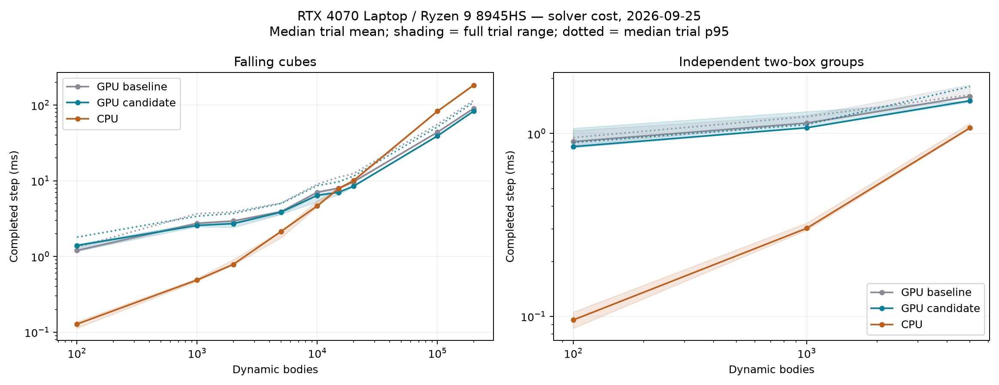

[Throughput](benchmarks/rtx4070-solver-cost-physics-2026-09-25-throughput.png),
[p50/p95](benchmarks/rtx4070-solver-cost-physics-2026-09-25-percentiles.png),
[GPU phase costs](benchmarks/rtx4070-solver-cost-physics-2026-09-25-phases.png),
and [validated physics data](benchmarks/rtx4070-solver-cost-physics-2026-09-25.json).

Experiments also tested velocity-only body stores and per-phase specialization
of broad-color or all color shaders. They did not show reliable additional
completed-step gains, so they are not enabled. All 72 pilot trials are retained,
including unfavorable pairs; they are separate from final qualification.

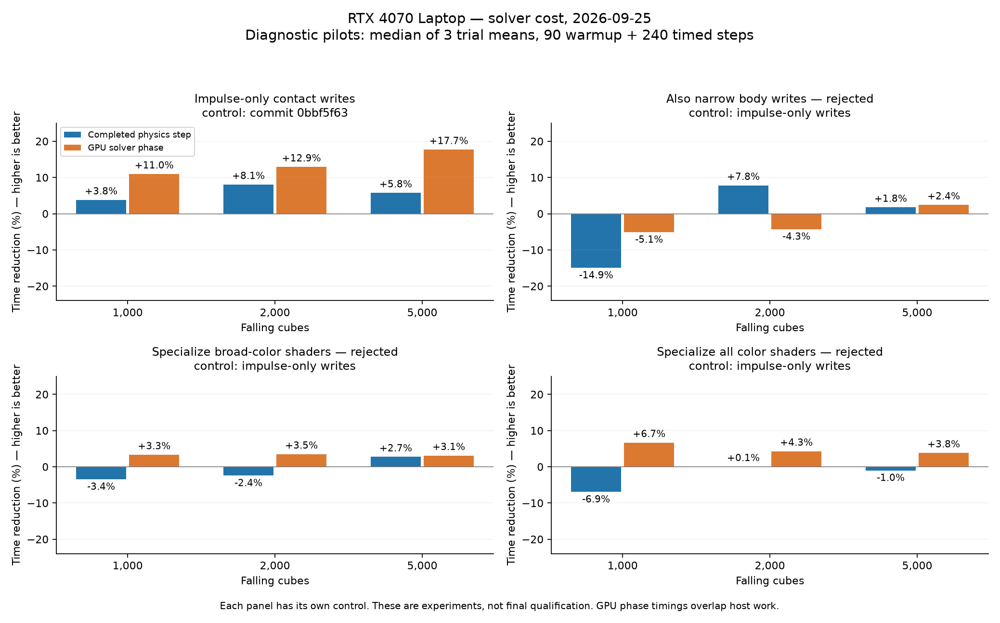

A controlled synthetic probe restored identical prepared inputs and compared
260 dispatches with 13 grouped dispatches using workgroup storage barriers.
Outputs matched byte-for-byte. Grouping helped at 64 contacts per color visit
but lost at 256 and 1,024 as parallelism fell. This supports retaining the existing
occupancy-based schedule. The repeated synthetic contacts are not a falling pile,
and these intervals do not estimate an additive dispatch overhead for the live app.

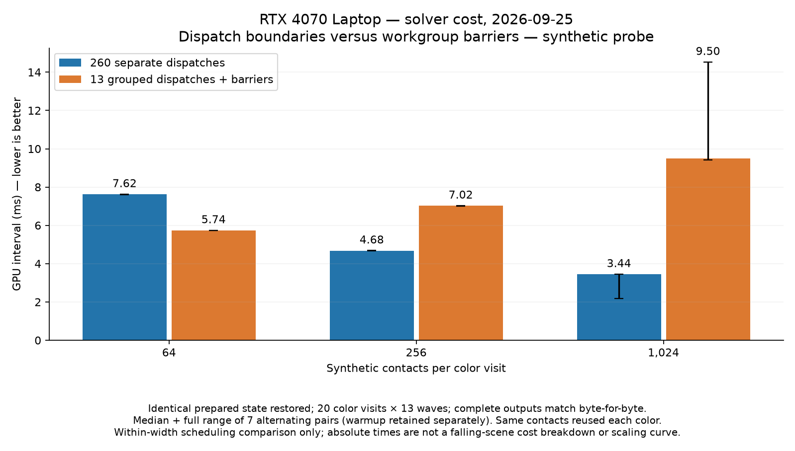

| Renderer / cubes | Baseline GPU FPS | Candidate GPU FPS | CPU FPS |
| --- | ---: | ---: | ---: |
| Direct / 1,000 | 33.1 | 32.1 | 37.8 |
| Direct / 5,000 | 31.9 | 32.5 | 33.2 |
| Direct / 10,000 | 31.2 | 30.7 | 28.8 |
| Direct / 20,000 | 29.5 | 30.4 | 22.5 |
| Sokol / 1,000 | 27.5 | 27.9 | 33.7 |
| Sokol / 5,000 | 25.4 | 26.2 | 27.8 |
| Sokol / 10,000 | 26.4 | 27.0 | 23.7 |
| Sokol / 20,000 | 20.4 | 18.7 | 15.5 |

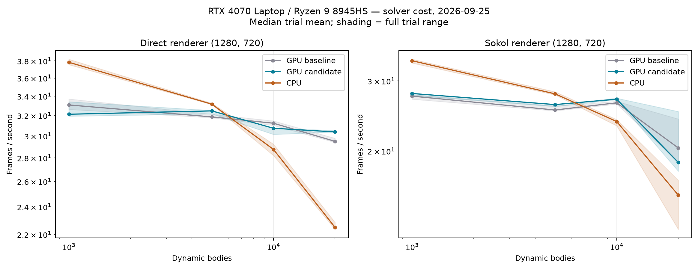

[Frame latency](benchmarks/rtx4070-solver-cost-renderers-2026-09-25-latency.png),
[frame p50/p95](benchmarks/rtx4070-solver-cost-renderers-2026-09-25-percentiles.png),
and [validated renderer data](benchmarks/rtx4070-solver-cost-renderers-2026-09-25.json).
Full-app results are mixed: direct-renderer frame time at 10k is slower in all
three pairs (+3.6%, +2.3%, +0.9%). Sokol at 20k drops from 20.4 to 18.7 median
FPS, with paired frame-time changes of −4.2%, +8.7% and +5.1%. These results
do not establish a general application speedup, despite the large-scene physics
gains. No runs were excluded.

Both renderers use matched 1280×720 viewports, NVIDIA hardware and unpaced
presentation on the same isolated Xvfb setup. These FPS values include application,
rendering and display costs; they are not native-desktop FPS ceilings.

All 276 native-cache library tests pass, plus nine cache-disabled checks. The
synthetic timing probe is ignored by default and passed separately. Coverage
includes bytewise full-record agreement after each solver phase, linked one- and
four-point manifolds, graph changes, spawning/destruction, slot reuse, growth,
cache invalidation and long replay reentry. Nineteen affected scenes were recorded
for 300 frames each, with 0 decoded frames differing from the baseline;
the real Box3D CPU comparison column remains pinned.

The [raw evidence archive](benchmarks/rtx4070-solver-cost-2026-09-25-raw.tar.gz)
([SHA-256](benchmarks/rtx4070-solver-cost-2026-09-25-raw.tar.gz.sha256)) includes frozen executable
identities, source hashes and patch, raw timings, environments, tests, rejected
experiments, recording hashes and reproduction scripts. Earlier charts and
archives remain unchanged. Box3D and the WASM package are unchanged.

To isolate solver scheduling costs, `profile-falling-solvers.py` reuses a completed
sweep's binary and environment, verifies its binary hash, and compares component
TGS with global contact-color dispatches. It alternates variant order across three
trials and preserves raw phase timings and machine telemetry. Both variants retain
the falling-cube workload, timestep, four substeps, and disabled sleeping. These
are diagnostic comparisons; promoting a scheduling change still requires solver
agreement checks and the full CPU/renderer sweep.

```sh
python3 scripts/profile-falling-solvers.py artifacts/falling-cubes/my-machine/manifest.json \
  artifacts/solver-profile --counts 5000 15000
python3 scripts/plot-falling-solvers.py artifacts/solver-profile benchmarks/solver-profile \
  --title 'Exact GPU • solver scheduling investigation'
```

The plot rechecks raw-file hashes and trial means, displays completed-step trial
ranges and median trial p50/p95 markers, and separates broadphase, narrowphase, graph construction, preparation,
and solving. Phase bars use medians of per-trial means; their sum is not presented
as an exact decomposition of median completed-step time.

The scaling investigation found and fixed a concurrent island-union bug: an
unconditional atomic minimum could overwrite an earlier parent link and lose a
connection. Compare-and-exchange now attaches only a node that is still a root.
The 15,000-cube regression checks every dynamic contact's island membership and
compares repeated global solves, component solves, and batched graph construction
at steps 1, 65, 78, 79, 90, 150, and 330. All sampled positions, rotations, and
linear/angular velocities match exactly after the fix.

Dynamic coloring now fetches and publishes endpoints cooperatively in batches of
256 contacts, while retaining the reference greedy decision order. Its shared
cache holds at most 512 endpoints rather than the entire world. Worlds above
8,168 bodies select this path automatically. Smaller worlds with at least 512
bodies, enabled shared/memo support, and no joints or triangle meshes also select
batching when dynamic-dynamic contact roots reach the body count. The existing
asynchronous status readback carries this density hint; selection returns to the
shared path below three quarters of the body count to avoid switching around the
boundary. Topology uploads discard older hints. Sparse groups and smaller worlds
retain shared/memo scheduling. Both paths validate their own cached inputs, and
command-cache keys include the selected path; a delayed hint cannot skip physics.
`GPU_PHYSICS_GRAPH_BATCHED=0` disables batching (shared/memo remains available);
`=1` forces batching for controlled comparisons. Disable `GPU_PHYSICS_GRAPH_SHARED`
as well to select the scalar reference below the shared-world size limit. With
`GPU_PHYSICS_GRAPH_MEMO=1`, the optional memo allocation now also supports large
worlds. Batches are anchored to 128-body ranges, with up to four cached chunks
of 256 edges per range, so changes in earlier ranges do not shift later cache
entries. A batch reuses colors only when its length, endpoints and incoming
dynamic-color masks match its cached inputs. Local color-list offsets are rebased against the current
counts; contacts and impulses are never cached. Changed batches run the original
ordered greedy walk. Allocation respects device buffer limits and falls back to
ordinary batching when unavailable; `GPU_PHYSICS_GRAPH_MEMO=0` disables it.
Focused tests cover hits, changed inputs, partial batches, reordered edges and
slot reuse, and the 15,000-cube impact comparison remains exact through step 330.
Contact solving writes back only normal, friction, twist and rolling impulses,
including accumulated normal impulses used by restitution. Preparation retains
ownership of geometry and prepared coefficients; contact identity, arithmetic,
color order and dispatch scheduling are unchanged. For a contact writeback, this
reduces the assigned fields from 352 bytes (hot plus prepared records) to
56 bytes of impulses; actual memory transactions depend on the compiler and GPU.
Global color solving can
still be selected with `GPU_PHYSICS_COMPONENT_TGS=0`; component TGS remains useful
for small independent islands but underutilizes the GPU on a large connected pile.
Spatial-hash insertion storage now grows geometrically with reserved shape
capacity (16 entries per reserved shape, rounded to a power of two, at least
1,024, also covering graph-prefix workspace). The three insertion arrays sit after the scene's fat bounds; their
runtime offsets avoid shader recompilation on growth. Oversized workloads still
report sticky capacity loss rather than silently dropping entries. Contact pools
now reserve 16 slots per reserved body, rounded to a power of two (minimum 256),
and pair capacity follows that reservation with a 65,536-entry floor. Runtime
scratch/hash offsets and chunked prefix scans replace the old fixed ceiling.
Growth preserves contact state and history, relocates occupied lists, and rebuilds
the hash index without compiling new shader variants. Capacity loss still
invalidates the run; unusually dense workloads may exhaust their reservation. A 30,000-cube first-step
regression records 100,305 spatial entries without capacity loss, exceeding the
old limit. The preceding capacity build passed all 260 NVIDIA library tests, including the insertion
boundary, full-width sorting and contact hashing, compaction beyond 65,536 entries,
contact-cache growth, and canonical coloring regressions.
The general static-contact sort now carries full contact indices and sorts on
32-bit body/color keys, removing its `(body << 16) | index` packing. It preserves
canonical contact order between its two stable sorts and retains four radix
passes per sort. Retained-contact lookup now stores two full-width identity words
per physical slot and publishes only the slot reference into the hash table.
A separate preparation dispatch makes both words visible before publication;
retirement leaves them intact until the next allocation phase. This uses the
existing hash allocation and also applies when growth or topology changes rebuild
the index. Grid pair generation now assigns each overlap one exact shared cell,
using insertion ordinals to distinguish cells even when their hash buckets collide.
Retained roots emit their existing pairs once; new overlaps append directly, so
pair generation no longer needs an online atomic packed-key deduplication table.
The independent all-pairs matrix agrees through cell collisions and mutations,
and raw append counts equal unique counts in those fixtures.
Broadphase pairs, retained-contact identities, previous-touching history,
callbacks, events, graph memoization, joint filters, and material lookup now
carry full 32-bit indices for both endpoints. Persistent contacts add an aligned
16-byte identity field; pair, history, and radix arrays use two words per entry.
Sorting preserves high-index-major order and skips unused high bytes: four
passes through 65,536 shapes, six through 16,777,216, then eight. Tests cover all
three widths and high-index contacts through callbacks, events, deletion/remapping,
and slot reuse. The Rust physics slot guards now reflect the public index and
graph-classification ranges rather than a 16-bit pair encoding. Device allocation
limits still apply. Native sample metadata uses stable-address chunks per world,
with direct-index geometry lookup and cleanup; independent CPU mappings also
check generations. `scripts/check-native-metadata.sh` exercises 100,001 entries,
callback growth, world isolation, reuse, and ownership under ASan/UBSan.
The batched pipeline is prepared at world initialization and reused across worlds
and capacity growth, so crossing the selection threshold does not compile a shader.

New completed-step raw runs include `allocations` for primary simulation buffers:
body state, the complete reserved scene heap (including geometry and materials),
contacts, joints, scratch, atomics, and fixed dispatch/query buffers. These are
allocated buffer bytes, excluding readback/timestamp staging, CCD resources,
renderers, pipelines, and driver overhead; they must not be labeled total VRAM.


For fresh CPU comparisons, `bench-falling-cubes.py --gpu-solver global` selects
the same global-color schedule and records the choice. `--gpu-binary PATH`
lets physics/direct runs use a preserved executable while work continues.
`--sokol-gpu-binary PATH` selects a preserved Sokol GPU executable for matched
renderer comparisons; both overrides are recorded with executable hashes.
The default still selects component TGS; all comparisons must report this setting.

The [pre-tiling CPU/GPU sweep](benchmarks/rtx4070-complete-scene-2026-09-24.json)
and [raw archive](benchmarks/rtx4070-complete-scene-2026-09-24-raw.tar.gz) preserve
the `1559a049` baseline, including all three failed 150,000-cube dispatch attempts.
Earlier investigations retain their own binaries, settings and source snapshots:
[batched graph coloring](benchmarks/rtx4070-batched-graph-2026-09-24-raw.tar.gz),
[capacity expansion](benchmarks/rtx4070-capacity-qualification-2026-09-24-raw.tar.gz),
[full-width identities](benchmarks/rtx4070-full-width-2026-09-24-raw.tar.gz), and
[the initial solver diagnostic that exposed the island-union bug](benchmarks/rtx4070-solver-profile-2026-09-24-raw.tar.gz).
That last diagnostic failed correctness and is not a qualified performance result.

The comparison grid retains the real Box3D CPU column first and records the
current GPU implementation in `2026-09-24-tiled-stable-buckets`. All 19 affected
scenes have 300-frame CPU/GPU clips. [Recording identities and clip checks](benchmarks/rtx4070-tiled-recordings-2026-09-24.json)
verify that the GPU recording binary matches the measured binary and the CPU
oracle is unchanged. Ordinary scene recordings are separate from the no-sleep
benchmark window. Run `bun run compare` to inspect the grid.

The preserved executable SHA-256 identifies the measured program. Raw `git` and
`source_sha256` fields describe the runtime working tree, which can include
documentation edits during a sweep; they are not compiled-source fingerprints.
Engine source hashes, source patches and build logs accompany the raw evidence.

The runner records adapter/driver, CPU, VRAM, power/clock telemetry, framebuffer,
settings, commands and binary hashes. Keep the raw output directory. To compare
a second PC, repeat the same workload/window/worker count/resolution and retain
both datasets. Report measured throughput ratios and CPU differences; GPU model
names or advertised FLOPS alone do not predict this workload's scaling. Host
submission, memory traffic, contact graph work and rendering can each limit it.

## Validation and recordings

Run from this directory on Linux with the required GPU/build dependencies:

```sh
python3 scripts/test-native-portability.py
python3 scripts/test-sokol-capacity.py
cargo test --release --lib -- --test-threads=1
./scripts/correctness-gate.sh artifacts/correctness-review.json
./scripts/native-scene-gate.sh
./scripts/check-both-pointer.sh
./scripts/check-shape-replacement.sh
./scripts/check-native-metadata.sh # Linux; requires the built CPU oracle
./scripts/check-joint-separation.sh
./scripts/check-joint-reaction.sh
./scripts/check-substep-forces.sh
./scripts/check-spawn-stream.sh
python3 scripts/audit-native-api.py --require-complete
```

The API audit intentionally fails while coverage is incomplete. It selects the
same portable build directories as the launcher; `--gpu-build-dir` and
`--both-build-dir` select explicit builds. Use `--require-built` to reject missing
artifacts without requiring full API parity. Missing artifacts are reported as
unknown coverage. Symbol coverage does not certify semantics.
Several diagnostic scripts retain Linux/NVIDIA assumptions. Required checks
reported as skipped or unsupported do not count as passes.

The default Vulkan precision path passes normal and strict ten-drag checks on
Linux Radeon 780M and RTX 4070 Laptop, with independent histories and unchanged
tolerances. After `check-both-pointer.sh`, run the produced `both-drag` binary with
`--ground-strict` on each adapter using `scripts/native-samples-cache-env.sh`.
See [qualification results](../../docs/gpu-physics.md#ground-drag-qualification)
for exact commands, limits and remaining failures.

For drag phase traces, build the fixtures first with `check-both-pointer.sh`,
then select the same build and library. For the cached Linux build:

```sh
GPU_PHYSICS_ADAPTER=amd DRAG_PHASE_RANGE=60:240 ./scripts/check-drag-phases.sh \
  artifacts/drag-phases-amd native-samples/build-both-native-cache-portable \
  target/native-cache-build/release/libgpu_physics.a
```

The diagnostic returns failure when the original strict drag gate fails, while
retaining `result.log` and `phases.log`. Tracing can change scheduling and floating-point code generation, so confirm
findings with the uninstrumented fixture too. Without build/library arguments,
it uses the ordinary portable build produced with caching disabled. For joint/contact
boundaries, also set `DRAG_CONSTRAINT_TRACE=1` and
`GPU_PHYSICS_AB=phase-capture,mesh-candidates`; trace overflow invalidates the
diagnostic. CPU phases 100/101 bracket relaxed joint solves, 102/103 biased solves.
`BOTH_DRAG_TRACE_BODY=-1` traces all five cubes; `B <frame> <cube-index>` records
identify the following state/contact lines. Values 0–4 retain single-cube tracing.

For visual or solver changes, record the affected scenes before committing:

```sh
./scripts/record-box3d-oracle.sh
./scripts/record-snapshot.sh YYYY-MM-DD-label
bun run compare
```

To capture a measured build without rebuilding it, set `GPU_RECORD_BIN` to its
absolute executable path. `GPU_RECORD_ORACLE` similarly preserves a specific CPU
oracle for the first column. Both scripts write `recording-manifest.json` with
binary hashes, requested frame counts, and GPU environment settings. Use the
same solver environment as the run being illustrated, and record outside timing
runs so capture and encoding do not affect benchmark results.

The grid places the real Box3D CPU reference first, followed by GPU snapshots.
Reports and recordings are ignored local outputs under `artifacts/` and
`recordings/`; fresh clones must regenerate them. They are not distributed via
Git LFS. Historical investigations are retained in Git history and local archives.

## Source map

| Path | Purpose |
|---|---|
| `src/api/`, `src/c_abi.rs` | World API and exported bridge |
| `src/sim.rs`, `shaders/` | GPU scheduling and physics kernels |
| `c_abi/` | Native compatibility layer and reference fixtures |
| `native-samples/` | CPU, GPU and combined Sokol viewers |
| `oracle/` | Upstream Box3D reference executable |
| `compiler/` | Optional pinned Vulkan backend patches |
| `scripts/` | Builds, correctness checks, recordings and benchmarks |

Architecture and current limitations: [GPU physics notes](../../docs/gpu-physics.md).
Measured performance and reproduction: [native backend guide](compiler/native-backend/README.md).
