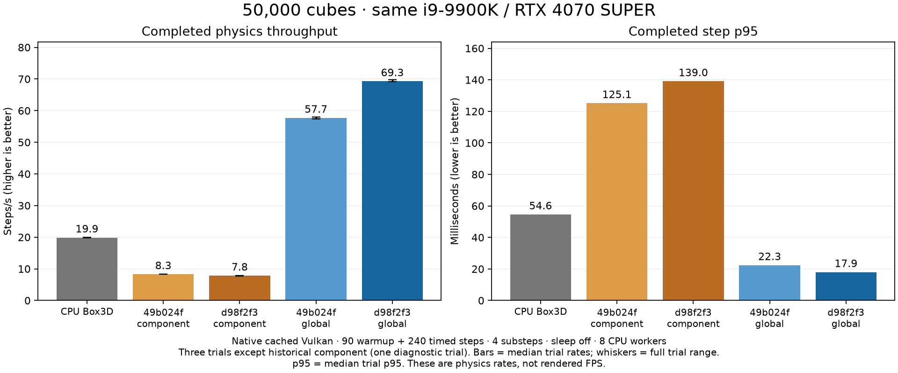

# 50k cube performance investigation — 2026-09-29

The large apparent slowdown was a benchmark configuration mismatch. The new
machine collector omitted `--gpu-solver global`, selecting component TGS, while
the published laptop crossover charts explicitly used global-color scheduling.
The collector now selects global explicitly. Engine code, physics arithmetic,
application defaults and all recent correctness fixes are unchanged.

## Same-machine historical controls

A detached worktree built `49b024f` with its pinned Box3D submodule. Current code
is `d98f2f3`. Both ran on the same i9-9900K / RTX 4070 SUPER, native cached Vulkan,
50,000 cubes, four substeps, no sleep, 90 warmup plus 240 measured steps. CPU uses
eight workers. No old laptop measurements were substituted. Builds/tests and
benchmark processes ran separately. These are normal desktop conditions, not
fixed clocks or an idle-gated laboratory measurement.

| Code / schedule | Trials | Completed steps/s | Step p95 ms |
| --- | ---: | ---: | ---: |
| Box3D CPU | 3 | 19.87 | 54.55 |
| `49b024f` component diagnostic | 1 | 8.28 | 125.13 |
| `d98f2f3` component | 3 | 7.82 | 139.03 |
| `49b024f` global confirmation | 3 | 57.71 | 22.34 |
| `d98f2f3` global confirmation | 3 | 69.26 | 17.92 |

Current global scheduling is 3.49× CPU throughput and 20.0% faster than the old
global control. Current direct-renderer FPS is 18.54 CPU / 68.92 GPU at an actual
1280×720, unpaced. Initial global screens (69.0 current / 57.8 historical) were
followed by the fresh three-trial confirmation above; they are not pooled into it.

The 8.28 → 7.82 component difference is retained, not claimed fixed or localized.
Only one historical component trial was collected. It does not explain the
roughly ninefold gap between current component and global schedules. The user
requested bisection, but no good/bad endpoint pair exists for the historical
fast global configuration: both endpoints beat CPU and current is faster.
Therefore no production commit was labelled bad or reverted. The exact cause
of the large comparison error is the new collector's omitted global option,
which was still uncommitted when found.



[Current CPU/GPU physics and rendered-FPS chart](../machines/charts/cube-scaling.png)

## Behavior evidence

The existing native NVIDIA test
`falling_cube_solver_schedules_match_through_impact` passed: one test, zero
failures. It compares 15,000 cubes through step 330 at seven checkpoints, including
impact, between global, repeated global, component and batched-graph schedules.
Position, rotation, linear velocity and angular velocity differences were zero;
contact islands and capacity checks also passed. This is the existing dense-scene
behavior fixture, not a claim of whole-engine qualification or a 50k exact-state
comparison. Full output: [behavior-equivalence.log.gz](behavior-equivalence.log.gz).

```sh
cd experiments/gpu-physics
source scripts/native-samples-cache-env.sh
GPU_PHYSICS_ADAPTER=nvidia scripts/build-native-cache.sh test --release --lib   falling_cube_solver_schedules_match_through_impact -- --nocapture --test-threads=1
```

## Reproduce and extend

[Machine datasets](../machines/README.md) retain original raw timing files/logs in
hash-verified compressed bundles. The old component sweep remains under
`../machines/component-baseline/`, including all CPU counts through 200k and every
completed GPU/render trial before the user stopped the full sweep at 100k.
Historical controls are under `../machines/history/`; current global 50k data is
at the machines root. The chart script checks executable hashes against
[build-revisions.json](build-revisions.json). Historical executable `git` fields
reflect the runner checkout, not compiled code; independent build receipts are
used instead. The source hash also cannot attest the native-workspace symlinked
sources. Raw evidence has not been rewritten to hide this metadata limitation.

From the repository root:

```sh
python3 experiments/gpu-physics/scripts/plot-cube-machines.py --validate-only
python3 experiments/gpu-physics/scripts/plot-cube-machines.py
python3 experiments/gpu-physics/scripts/plot-cube-regression.py
```

The shared helper fixes desktop scaling at one physical pixel per requested
pixel and rejects framebuffer mismatches. Its default count list still supports
100 through 200k; `CUBE_COUNTS=50000` restricts the next machine to this bounded
comparison. Different count lists may share charts, but different solver settings
are rejected by default. Use the [other-computer prompt](../machines/OTHER_MACHINE_PROMPT.md)
to add another machine, rerender, commit and push on the investigation branch.
