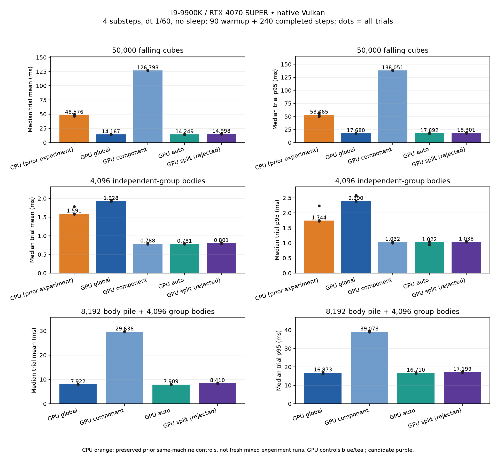
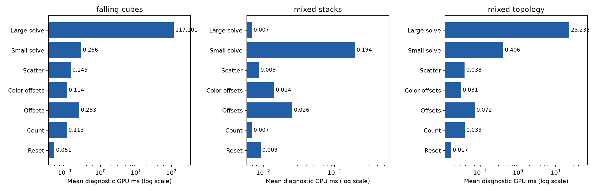

# Desktop mixed-topology scheduling — fixed experiment, 2026-09-30

**The performance target remains unmet. Both solver candidates are rejected and
production solver changes are restored.** The best candidate regressed mixed
median mean time **6.34%**, rather than improving it 10%; its 50k-cube mean
regression **5.25%** also exceeds the 5% guardrail. Independent-group mean/p95
regressions are 2.55%/1.55%. No default policy or new scheduling override ships.

## Completed-step controls and confirmation

Intel i9-9900K / NVIDIA RTX 4070 SUPER, driver 610.57.04, native cached Vulkan on
the actual NVIDIA adapter. Four substeps, dt 1/60, sleeping disabled, 90 warmup
and 240 timed queue-completed steps, three fresh-process trials per configuration.
Color prefix 20, same native cache/CCD/ordering settings in all headline runs.
Completed-only benchmark mode skips the separate CPU and pose-mirror passes;
the timed step+wait is unchanged. Zero auxiliary mirror/getter fields in these
raw files represent unmeasured passes and must not be interpreted as zero cost.

Global/component use the initial controls; auto/candidate use the alternating
confirmation batch. Candidate means the second, rejected split implementation.
Each reported value is the median of trial means or trial p95s; throughput is
1000 divided by the median trial mean. Every timing sample and trial is retained.

| Fixture / path | Median mean ms | Steps/s | Median p95 ms |
| --- | ---: | ---: | ---: |
| 50k cubes — global | 14.1666 | 70.59 | 17.6797 |
| 50k cubes — component | 126.7929 | 7.89 | 138.0512 |
| 50k cubes — auto | 14.2494 | 70.18 | 17.6918 |
| 50k cubes — candidate | 14.9979 | 66.68 | 18.3006 |
| 4,096 groups — global | 1.9277 | 518.75 | 2.3905 |
| 4,096 groups — component | 0.7883 | 1268.55 | 1.0322 |
| 4,096 groups — auto | 0.7809 | 1280.62 | 1.0222 |
| 4,096 groups — candidate | 0.8008 | 1248.78 | 1.0380 |
| Mixed 8,192 + 4,096 — global | 7.9224 | 126.22 | 16.8728 |
| Mixed 8,192 + 4,096 — component | 29.6362 | 33.74 | 39.0781 |
| Mixed 8,192 + 4,096 — auto | 7.9090 | 126.44 | 16.7104 |
| Mixed 8,192 + 4,096 — candidate | 8.4102 | 118.90 | 17.1994 |

Initial auto control means were 14.1845 / 0.7826 / 7.8770 ms for cubes, groups
and mixed respectively. Confirmation auto/candidate mean changes are
+5.25% / +2.55% / +6.34%; p95 changes are +3.44% / +1.55% / +2.93%.
Against the fastest explicit initial control, the candidate is slower by 5.87%
for cubes (global), 1.58% for groups (component), and 6.16% for mixed (global).
Component remains useful on independent groups; beating its much slower mixed
control would not establish an improvement over global or automatic.



Dots show all three trial values. CPU bars are orange and reuse clearly labelled
prior same-machine controls from the preserved two-fixture dataset. They are
context, not new timing runs; no mixed CPU performance result is claimed.

## Frozen fixtures and measured topology

Exactly three fixtures: existing 50,000 falling cubes; existing 4,096 bodies in
2,048 independent two-box groups; and new `mixed-topology`, fixed at 12,288
dynamic bodies. The mixed fixture uses the original two overlapping 309m
half-extent grounds, the groups translated +150m in X, then 8,192 cubes with
the original falling-cube layout. All shapes, materials, body and world defaults
are preserved. No configurable scaling range is introduced for the new fixture.
Rust and real Box3D CPU constructors mirror these positions and creation order.

Separate diagnostics sample topology at steps 91,111,...,311,330 on all mixed
controls and the second candidate. The global control's largest island contains
7,926–8,185 bodies, alongside the 2,048 original two-body groups, with zero
islands crossing between the regions. Later fragments add small islands. The
new correctness fixture independently requires every original group to remain
an island of size two and at least 6,144 pile bodies in one island at 90,150,330.
The benchmark scene therefore contains both intended topology classes throughout
the sampled window, rather than merely being labelled mixed. These diagnostics
sample the window; they do not assert every intermediate step's full histogram.
All 240 headline steps record selected solver dispatch counts: controls select
2 for component and 325 for global/automatic; split selects 326 on mixed/cubes
and retains 2 on the independent fixture.

## Diagnosis and rejected implementations

Whole-world automatic selection routes the independent groups to global when
combined with the pile. Independent groups alone benefit from component solving,
but the two tested splits do not turn that fact into a net mixed-world gain.

Candidate 1 classifies current islands using the existing small-component register
limits (eight bodies and 32 contacts), solves those islands locally, and checks
ownership in each global integration/contact phase. Its two mixed pilots are
9.5824 and 9.6286 ms. Repeated root/metadata checks add substantial GPU work:
this version is rejected before confirmation. Candidate 2 builds per-body
ownership once and stably compacts global lists once per color, avoiding repeated
root walks and preserving retained contact/color order. Its pilots improve to
8.4102 and 8.3724 ms but still lose to automatic; the fixed confirmation confirms
the failure. Both explicit 0/1/auto paths, eligibility exclusions and complete
constraint coverage were preserved during testing. Invalid component lists
fall back to the full global path. No fixture or machine thresholds were used.

Separate timestamp diagnostics divide reset/count/offsets/color-offsets/scatter/
small solve/large solve. For the mixed component control, list construction costs
0.196 ms, small solving 0.406 ms and large solving 23.232 ms. For cubes the large
kernel costs 117.101 ms; independent groups' small/large costs are 0.194/0.007 ms.
The large component kernel still assigns only one workgroup per large island.



The sixth diagnostic separates the second candidate's reset 0.0058, count 0.0391,
offsets 0.0726, scatter+ownership 0.0521, small solve 0.4157, global filtering
0.0454 and global solve 2.3889 ms. Explicit global's corresponding whole solve
interval is 2.5091 ms: splitting saves only 0.1202 ms of global solve work while
adding 0.6317 ms. Total split solve interval is 3.0211 ms. This directly supports
setup/ownership and extra small solving outweighing the removed global work.
It does not prove that every possible per-island scheduler is unhelpful.
No occupancy counters or broad crossover sweep were collected. Diagnostics
have extra timestamps, topology reads and full replay disabled, and are excluded
from headline timing. Host submission/completion timings are separate overlapping
measurements, not additive decompositions of completed-step time.

## Fixed budget, behavior and restoration

Budget frozen before measurement and fully consumed: **27 baseline, six diagnostic,
four pilot and 18 confirmation runs**, 55 fresh processes total. Baseline order
reverses on the second trial; confirmation reverses baseline/candidate order on
the second trial. One confirmation candidate, exactly two candidates/two pilots
each, no selective extra rounds or discarded trials. Builds, checks and recordings
are outside timing. Collection crossed into 2026-10-01; folder retains start date.

Both candidates' mixed global/component/auto/split comparisons and repeated runs
had zero sampled position, rotation, linear and angular velocity differences at
1,65,78,79,90,150,330. A first transition-test fixed-dispatch assertion failed
because adaptive color prefix yielded 169 rather than 325; it was replaced by a
path assertion. An intervening private-field access failed compilation and was
fixed. These logs are retained; neither change relaxes a physics tolerance.

After restoring all production shader/scheduler/world-policy files byte-exact to
HEAD, 68 relevant test executions pass: five scheduling tests, 18 component tests,
the original dense schedule comparison, three long replay/reentry executions,
island/capacity selections and 28 precision tests. New mixed comparisons preserve
1e-5 schedule tolerance, exact automatic repeats, contact-island membership,
capacity assertions and original independent-group physical criteria. Explicit
component/global/auto transitions and exact repeats pass. The restored native release
executable matches the frozen measured baseline byte-exact. A subsequent optional
recording-camera change affects only MP4 rendering; its separate build/source/hash
receipt identifies the final recording executable and is not a timed candidate. This is bounded
behavior evidence, not whole-engine, Rain or laptop requalification.

Only the new fixture affects final visible geometry. Before commit it is recorded
for 300 frames on real Box3D CPU and restored automatic GPU; a shared explicit
recording view shows both spatial regions and real CPU remains first
in the grid. Initial cropped-camera clips and their hashes remain local evidence. Older scene clips are preserved. Clip/source hashes and recording
receipts accompany the raw bundle; local videos are not checked into Git.

## Provenance and portable data

All source builds start from revision `287cba5` plus their recorded source patches.
Each has independent engine-input hashes, build command/log, native backend config
hash and executable hash. Runtime `git`, `dirty` and `source_sha256` describe the
invocation workspace, including native-workspace symlinks; they are not compiled
source proof. Test-only additions made immediately after the first diagnostic
build are recorded separately with the reconstructed original test input hash.

- baseline: `25fa9372d9132643c8c885de4b779bc701bcf5dbe21d20ec39924c7fb8dcb203`
- candidate1: `8d52c45e6da8156ec5b61c70b83d0ff00957f68d34b4f54b278853eee7680101`
- candidate2: `773d4a3099c8a48b6b8088722272dfa1d9b6a2e1062cb74fedff2efe4d836180`
- diagnostic: `8c9f8972423b5e9b321cb93fe53a840400224cc771a8a57fd36c5ffa131063ff`
- diagnostic2: `9a995b596c2003eadebf24b53c1191d1ccd9d45863213d8da7f4546bb9520811`
- recording only: `68a3f46f00a2b338d09abc8d1f63a0ae6a6e96a54dbfcb5aeeedebcc2e3ecddb`

[Results](results.json) and [hash-checked raw data, patches, logs and receipts](raw.json.gz)
retain all 55 trials, exact commands/environment, CPU/adapter/driver, telemetry,
raw completed-step and diagnostic samples, topology, build and check receipts,
source restoration proof and recording metadata. Executables remain local.
Existing machine datasets and the earlier scheduling dataset are unchanged.
Box3D submodule and WASM are unchanged; production policy remains 0/1/auto.

Validate or redraw without GPU work, from `experiments/gpu-physics`:

```sh
python3 scripts/plot-mixed-scheduling.py benchmarks/mixed-scheduling-2026-09-30 --validate-only
python3 scripts/plot-mixed-scheduling.py benchmarks/mixed-scheduling-2026-09-30
```

The collector's baseline mode can reproduce the 27 controls with a newly built
native executable and a new output directory. Freeze after a successful explicit
native build, then run baseline. Historical candidate replay requires the archived
candidate source patch at the recorded base revision or the preserved executable;
`split` is deliberately absent from the final production build. Do not resume this
experiment or add measurements to its exhausted budget. This desktop diagnosis
leaves alternate scheduling designs, Rain, complex joints, laptops, scaling and
any default-policy change to separate goals.
