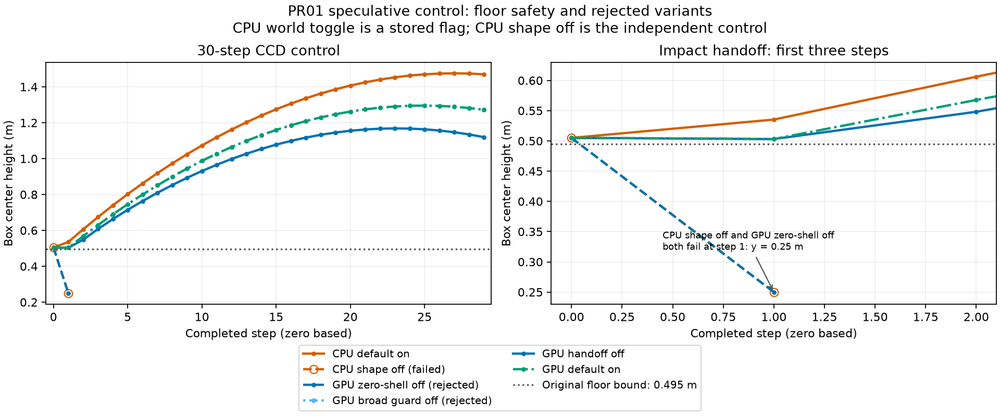
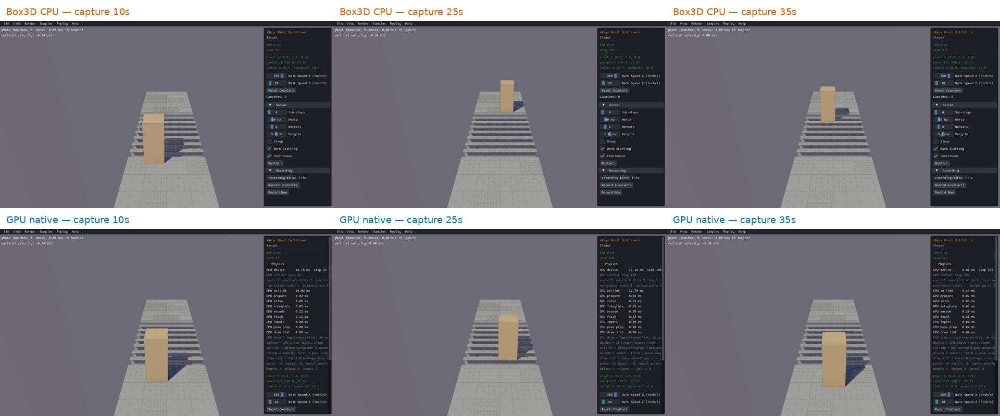

# PR01: speculative-contact world control

The GPU world setter now gates the existing experimental **hull–mesh** feature.
The default remains enabled. Either endpoint's per-shape false flag still wins;
convex–convex, sphere–mesh and capsule–mesh behavior is unchanged. This is a
control/correctness milestone, not a performance experiment or release qualification.
The [production roadmap](../../../../../docs/goals/gpu-production-readiness.md)
remains authoritative. **PR01 functional acceptance passes after source applicability review.**
The added all-window floor screen remains failed and the frozen-baseline viewer
diagnostic remains incomplete. Their scope and limitations are documented below.
PR02–PR10 remain open; this is not engine release qualification.

## Behavior and the CCD exception

`b3World_EnableSpeculative` forwards to the GPU world, and the combined adapter
also forwards to its mapped CPU world. Repeated off/on changes invalidate cached
hull–mesh manifolds on the next positive step. A zero-duration step preserves the
pending refresh. World state is independent and resets on destruction/recreation.
Diagnostic overrides cannot silently replace this policy.

The pinned CPU implementation stores its world flag without consuming it in
collision detection. Its experimental **shape** switch is the independent control
for hull–triangle positive-gap witnesses. Do not infer CPU world-toggle parity.
Neither this work nor its fixtures modify Box3D or WASM.

Disabling the feature normally discards positive-gap hull–mesh points. With CCD,
an actual preceding solid hit retains the existing TOI support shell:
`LINEAR_SLOP + 0.25 * LINEAR_SLOP = 0.00625 m`. This prevents the next step from
falling through the CCD centroid fallback. Existing captured `FAST` and
`CCD_NO_HIT` flags distinguish that handoff from a fast tangent/no-hit gap.
The ordinary experimental range is 0.02 m. This exception is explicit: “off” does
not remove the narrow support manifold needed after an actual CCD impact.

## Frozen experiments and all outcomes

| Protocol | Consumption and outcome | Evidence |
| --- | --- | --- |
| Initial zero-shell | Baseline 1/1 reproduces old no-op; CPU reference 1/1 fails shape-off CCD; first GPU trial 1/20 fails CCD; remaining 19 cancelled. One separately frozen diagnostic each for CPU/GPU reproduces the failure. | [Protocol](raw/protocol.json), [CPU diagnostic](raw/cpu-diagnostic.json), [GPU diagnostic](raw/gpu-diagnostic.json) |
| Broad fast-body guard | 20 C confirmations, 4 guards, 10 full-state repeats and 126 regressions pass their assertions. **Rejected**: its fast tangent 5 mm gap has a contact despite no CCD impact. | [Protocol](raw/ccd-safe-protocol.json), [scope defect](raw/ccd-safe/ordinary-gpu/ccd-guard.stdout) |
| Actual CCD handoff | 20/20 C confirmations (5 fresh processes each ordinary/native × GPU/combined), 4/4 stricter guard controls, one CPU tangent reference, 10/10 full-state captures and 126/126 regressions pass. | [Protocol](raw/handoff-protocol.json), [ordinary](raw/handoff/ordinary-gpu/receipt.json), [combined](raw/handoff/ordinary-both/receipt.json), [native](raw/handoff/native-gpu/receipt.json), [native combined](raw/handoff/native-both/receipt.json) |

Each hypothesis has a fixed budget and stop/retain rule established before its
runs. Neither rejected campaign's remaining budget is reused. No timing runs
were conducted. Warmup is not applicable to these assertion fixtures.

The C fixtures cover substeps 1/4, endpoint flags at creation and runtime,
world transitions, zero-duration steps, multiple worlds, recreation, exclusions,
overlap and CCD on/off. The upstream C API exposes the shape flag at creation;
its runtime transition is exercised through the Rust export. Combined runs
instrument the mapped CPU setter calls. The fast CCD control retains the original
center-height floor bound **0.495 m** for a box of half-height 0.5 m; no physical
tolerance was relaxed. The stronger guards require zero contacts at both 5 mm
and 10 mm positive gaps for resting and fast tangent bodies, with CCD on/off.

[Chart rows](ccd-controls.csv) and [plot generator](chart.py) include failures.
The CPU shape-off and rejected GPU zero-shell failures overlap at frame 1:
center height 0.25 m. The broad guard's CCD trajectory also overlaps the current candidate
handoff trajectory, but its separate gap control fails the intended semantics.
These checks establish floor safety, not identical CPU/GPU trajectories or a
complete restitution/energy qualification.

## Complete captured-state repeats and regressions

The final control fixture captures **110 completed steps** in each of five fresh
processes per backend: 20 transition steps followed by 30 CCD steps with each of
world, convex endpoint and mesh endpoint disabled. Every frame passes capacity,
invalid-state and completion checks. Raw schema-v23 state compares exactly within
each backend; ordering is retained, with no field filtering or relaxed physics
limits. Added future-relevant booleans are `enable_speculative`,
`speculative_changed` and the already existing warm-start policy.

- [Ordinary comparison](raw/handoff/state-ordinary/comparison.json) and [receipt](raw/handoff/state-ordinary/receipt.json).
- [Native comparison](raw/handoff/state-native/comparison.json) and [receipt](raw/handoff/state-native/receipt.json).
- [Frozen 63 selectors](raw/handoff/regression-selectors.json), [ordinary results](raw/handoff/regressions-ordinary/receipt.json) and [native results](raw/handoff/regressions-native/receipt.json).
- [State storage/comparator checks](raw/state-storage-checks.log): 14 tests, including required-v23-field corruption controls. Older datasets/readers remain supported.

This is repeat evidence for the control fixture. It does not close PR07's final
whole-matrix, Rain, ragdoll or dragging requirements. The rejected candidate's
captures/results are retained separately and are not substituted for final ones.

## Build and device provenance

Starting checkout: `bd4f7966151028542297be81a330e80e83687531` with the documented
local PR01 edits. The exact compiled engine inputs, commands, successful exits,
logs and library hashes are in [ordinary](raw/handoff/build-ordinary.json) and
[native](raw/handoff/build-native.json) build receipts. C fixture receipts identify
adapter source hashes, linked archives, executable hashes, runtime settings,
Rust toolchain and NVIDIA driver. This is stronger than invocation checkout metadata.

[Source index](source-index.json) resolves each engine input from its recorded
base Git revision plus byte-exact [source overlays](source-overlays). The two
rejected implementations were reconstructed only where necessary and verified
against their original recorded SHA-256 inputs. [Raw index](raw-index.json) records
stored and original hashes. JSONL traces are losslessly gzip-compressed with
stable timestamps; decompress before using the existing comparison tools.

All GPU fixtures select **NVIDIA GeForce RTX 4070 SUPER / Vulkan** on the
**i9-9900K desktop**. Ordinary and native cached paths are qualified separately;
GPU contact ordering is explicitly enabled in the raw state/regression campaign.
Runtime cache policy is recorded, rather than inferred from the executable name.
These runs do not qualify other hardware, platforms or default-policy changes.

Current linked inventories: [ordinary](raw/handoff/api-audit-ordinary.json) and
[native](raw/handoff/api-audit-native.json), with **415 required stateful symbols,
zero additional missing/duplicate definitions, 35 stubs, 8 known placeholders and
10 CPU-only wrappers requiring review**. The speculative setter is no longer a
stub or CPU-only passthrough. Remaining contract gaps belong to PR02.

## Reproduction

From `experiments/gpu-physics`, rebuild the corresponding library with the receipt's
command and compile the checked-in fixtures through `scripts/check-speculative.py`.
Use new result directories; the runners refuse to overwrite prior evidence.
Ordinary uses `--stage candidate --backend ordinary --linkage gpu`; native uses
`--backend native`. Select `--linkage both` for mapped dual controls. Supply
`--library` and `--build-receipt` to validate compiled inputs and linked identity.

`check-speculative-state.py --help` documents the five-process captured-state run.
Its explicit test selector is recorded in each receipt. For offline verification,
decompress a configuration's five JSONL files, run
`scripts/check-core-state-health.py` on each and use `scripts/compare-core-state.py`
in raw mode. Recreate charts with `python3 chart.py` in this directory.
`publish.py` is the delivery recipe; it retains all eligible local campaign data,
excludes binaries/generated build trees and refuses unresolved compiled inputs.

## Native scene review: original failure retained

The real CPU and native GPU viewers each complete 300 steps of
`Issues/s&box Ghost Collisions`, preserving upstream geometry and defaults.
Both report zero ghost launches under the scene's original 0.5 m/s criterion,
finite state and matched completed/submitted steps. The additional generic
5 mm floor screen is **failed** in both engines: minimum center height
0.908670902 m on step 6, versus bound 0.9094 m. Initial positions through
step 16 match exactly; the maximum height difference across all 300 steps is
0.00143975 m. CPU/GPU agreement does not erase the failed screen or establish
final physical qualification.

Portable full clips: [real CPU](recordings/sbox-cpu.mp4),
[native GPU](recordings/sbox-gpu-native.mp4). These are capture-time samples, not
matching physical-step timestamps; raw health data supplies the step comparison.

[CPU raw health](raw/handoff/native-scene-cpu/health.json),
[GPU raw health](raw/handoff/native-scene-gpu/health.json), their `review.json`
files and serial build/capture receipts retain these results. Physics runs on
NVIDIA Vulkan; the isolated 1280×720 Xvfb viewer uses Mesa llvmpipe for rendering.
Clips include startup/loading. Their incidental timing fields are not controlled
solver-performance data and are not used for a speed claim.

A separately frozen one-run [baseline attribution protocol](raw/handoff/sbox-baseline-attribution/protocol.json)
rebuilds the archived pre-PR01 adapter against the byte-verified frozen native
library. It times out after 180 seconds during startup, with no completed health
report. Its [failure receipt](raw/handoff/sbox-baseline-attribution/timeout.json),
logs, original sources and invalid unfinalized capture are retained. **No
qualification credit or selective retry follows.** The timed-out viewer provides no attribution result. The offline source review
below explains the initial landing; full physical release qualification remains
open. The current production candidate is pending the milestone commit.

## Standard recordings and portable delivery

All 20 standard scenes were recorded with the required CPU oracle and GPU
snapshot scripts: **40 valid clips, 300 frames each, 1280×720 at 30 fps**.
[Clip index](recordings.json) links every portable MP4, hash and scoped capture
manifest to the compiled renderer/oracle receipts. Native s&box adds the two
full clips above. Standard captures use scene defaults; they are not substitutes
for the 50,000-body timed fixture or the final qualification matrix. Mixed topology
uses the existing shared wide camera showing both spatial regions.

The [comparison-grid receipt](comparison-grid.json) verifies real CPU first,
latest GPU next, and every standard/native clip present. Old CPU recordings are
retained in a local archive; prior benchmark datasets are unchanged. First/last
frames of all scenes were visually inspected through the portable sheets:
[group 1](recording-review/group-1.png), [group 2](recording-review/group-2.png),
[group 3](recording-review/group-3.png), [group 4](recording-review/group-4.png).
They show the intended geometry and plausible motion, including both mixed
regions; this review does not replace analytical or full-window physics checks.
The [review generator](review-recordings.py) reproduces these sheets.

## Source applicability and PR01 acceptance

[Offline source review](source-review.json), reproduced by
[review-source.py](review-source.py), evaluates the source-native float32 setup and
four-substep semi-implicit gravity integration independently of contact results.
For **all first six steps**, computed height and vertical velocity match both
recorded engines exactly as float32 values. Step 6 is the first discrete landing:
its 31.718731 mm vertical motion reaches center 0.908670902m. Response begins on
step 7. No revised bound or substitute passing floor screen is used.

The pinned native `b3MeshTimeOfImpactFcn` skips a solid floor-plane sweep when
centroid descent is less than the fallback radius and its final centroid remains
above that radius. This character's radius is0.2032 m, so the initial descent meets
that condition; the GPU mesh sweep preserves the same filter. Native CPU fast
classification also uses half the body extent. Disabling experimental hull–mesh
positive-gap witnesses leaves this discrete landing behavior, as the original
upstream scene requests. The added all-window 5 mm bound was borrowed from the
separate 150 m/s normal-impact control; it is not that control's assertion applied
to equivalent motion. The **0.495 m isolated CCD bound and every original
physics/reference tolerance remain unchanged and pass**.

The added native screen remains **FAIL**, with its raw receipts and chart intact.
It is a useful reminder that transient penetration criteria must follow scene
motion, solver timing and tuning. CPU agreement alone was insufficient; the
independent integration and source analysis explain this event. They do not
qualify every later contact or introduce a final release tolerance for this scene.
PR03 still freezes the complete physical contract before PR04 fixes/final runs.

The [requirement audit](acceptance.json) closes the original PR01 functional
contract: meaningful world/endpoint controls, correct mapped routing, default
preservation, transitions/lifetimes, CCD interaction, both backend checks,
repeatability, API/docs and pre-commit recordings. The 180 s archived-baseline
startup diagnostic remains incomplete; source places it before collision
preparation finishes and explicitly allows compilation to take minutes. It
cannot distinguish compilation delay from a hang. PR05 owns final runtime/startup
qualification; this old run is never counted as a pass.

All capture/build/check jobs are terminal. The control milestone is ready for
commit; release readiness remains open. Existing datasets and every rejected,
failed or incomplete result remain preserved.
