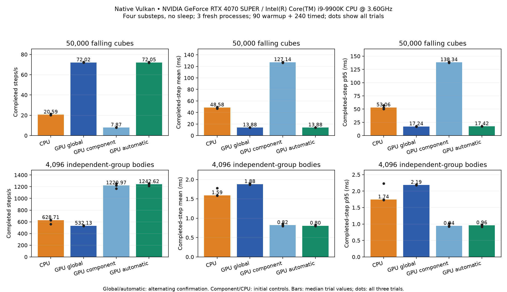
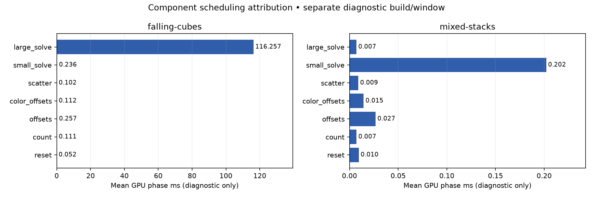

# Bounded scheduling qualification — 2026-09-30

Automatic scheduling meets the bounded performance target on the desktop. It
retains component solving for independent groups and selects global colors for
dense contact graphs. Enable it with `GPU_PHYSICS_COMPONENT_TGS=auto`; native
launchers now preserve this override. `0` forces global and `1` forces component,
subject to existing world eligibility. Application and collector defaults remain
unchanged. This is two-fixture scheduling qualification, not whole-engine or
laptop qualification; the older Rain correctness goal remains unfinished.

## Completed-step results

Intel i9-9900K / NVIDIA RTX 4070 SUPER, NVIDIA 610.57.04, native cached Vulkan.
Exactly two fixtures: 50,000 falling cubes and 4,096 mixed-stack bodies, comprising
2,048 independent two-box groups over the existing two overlapping static grounds.
Four substeps, dt 1/60, no sleep, 90 warmup + 240 timed steps. Global and automatic
use color prefix 20; that global grouping option is not consumed by the component
kernel. Exact environments and commands remain in the raw manifests.

| Fixture / schedule | Median trial mean ms | Completed steps/s | Median trial p 95 ms |
| --- | ---: | ---: | ---: |
| 50k cubes — Box3D CPU | 48.576 | 20.59 | 53.065 |
| 50k cubes — component | 127.137 | 7.87 | 138.342 |
| 50k cubes — global | 13.884 | 72.02 | 17.237 |
| 50k cubes — automatic | 13.879 | 72.05 | 17.417 |
| Independent groups — Box3D CPU | 1.591 | 628.71 | 1.744 |
| Independent groups — component | 0.819 | 1,220.97 | 0.941 |
| Independent groups — global | 1.879 | 532.13 | 2.187 |
| Independent groups — automatic | 0.805 | 1,242.62 | 0.958 |

Automatic reduces cube step time **89.08% against component**, the current native
application path. Independent-group mean time improves 1.74% and p 95 increases
1.72% against component, both within the 5% regression limit. Compared with
explicit global, automatic reduces independent-group mean time **57.18%** and
p 95 **56.22%**; cube mean changes −0.04% and p 95 increases **1.05%**. It does not
beat global on the cube pile. Its benefit is choosing the useful path for each
of these workloads, without a benchmark-name or machine-specific threshold.

Each headline configuration has three fresh-process trials. Initial controls
alternate global/component order; confirmation alternates preserved baseline-global
and candidate-auto order. The table uses confirmation global/automatic trials and
initial component/CPU controls. Initial global cube/group means were 13.695/1.897 ms;
all controls are retained. Bars show medians of trial values, dots show every trial.
CPU trials are standalone controls; the GPU runner's separate embedded CPU and
pose-mirror passes are preserved but excluded from headline GPU timing.



The budget was fixed before measurement: 12 GPU baseline runs, six optional CPU
controls, four diagnostic runs, at most two candidates with two pilots each, and
12 confirmation runs for one candidate. Only one candidate and two pilots were
used. No 100–200 k sweep, Rain investigation, selective extra rounds or discarded
unfavorable trials. Builds, checks and recordings ran outside timed trials.

## Measured cause and implementation

Component diagnostics separate reset/count/offsets/color-offsets/scatter/small
solve/large solve. In the primary 240-step cube window, list construction averages
**0.634 ms**, small solving **0.236 ms**, and large solving **116.257 ms**: the large
kernel accounts for **99.3%** of this measured component build/solve interval.
At step 330, the topology contains one **49,697-body** island and 251 small islands.
Source inspection explains the bottleneck: each large island receives just one
64-thread workgroup, looping through all member bodies and contacts across colors
and substeps. Global scheduling spreads each color across the device. Device
underutilization is inferred from this design and the measured kernel cost; no
hardware occupancy counters were collected. Fewer
launches alone do not compensate for this loss of work distribution.

Independent groups end with 2,048 islands of exactly two bodies. Their small solve
averages **0.202 ms**, large solve **0.007 ms**, and list construction **0.067 ms**.
Component retains two solver launches versus 325 global solver launches; initial
headline encoding is about 0.14 ms for either cube schedule. Separate host profiles,
with full replay disabled, show cube component submission 0.293 ms and remaining
completion 126.333 ms, versus global 1.495/13.716 ms. These overlapping host/device
measurements are not additive. They support a device-solver bottleneck, rather
than expensive host preparation or extra host synchronization.



Diagnostics use a preserved instrumented build; all seven component phase queries
and the preparation bypass are recorded in `diagnostic.patch`. They are not
production changes or headline timings. The collector logs a second 240 step
pose-mirror pass; the phase plot explicitly uses only the FIRST 240 rows (steps 91–330).

`auto` reuses the existing graph density hint carried by ordinary asynchronous
status. Dynamic-dynamic contact roots at least equal to the body span select
global; the existing three-quarters hysteresis returns to component below that
boundary. Static contacts do not connect the independent groups. Topology uploads
discard earlier hints. A delayed hint may select a slower schedule, but both
paths always retain the complete constraints. Existing callback, joint, Jacobi
and body-capability exclusions still select global. No shaders, physical defaults,
contact arithmetic, constraint order, new synchronization or readback were added.
The existing replay key already includes the selected component/global path;
the new requested automatic policy is included in host-state captures.

This density is a measured scheduling heuristic, not an exact island-size proof.
The observed useful point is 2,048 independent two-body groups, contrasted with a
single dominant connected pile. No crossover range, arbitrary independent-group
sizes, other topology or other hardware has been qualified here.

## Behavior and provenance

The existing 15,000 cube schedule comparison preserves every original tolerance,
repeatability, island and capacity assertion through step 330 and now includes
automatic and repeated automatic runs. All sampled position, rotation, linear
velocity and angular velocity differences are zero. The new 4,096 body fixture
checks global/component/auto/auto-repeat through 330, exact component/repeat agreement,
original independent-layer physical criteria, island membership and capacity.
The additional policy fixture verifies explicit overrides, stale-hint rejection
after topology upload and subsequent schedule reentry. It passes without relaxing
physics checks. Component, replay, island and capacity selections total 36 passing
test executions; the final dense test additionally requires exact automatic repeat equality
in the test-only module and passes; the original exact global repeat is preserved. Detailed logs and commands
are portable. An initial missing
import in the new test failed compilation, was fixed, and its log is retained.

Build receipts attest the measured executables independently of runner checkout
metadata. Baseline source revision is `b3454f8` (its unchanged engine binary also
matches the earlier `d98f2f3` receipt). Candidate is that source plus the recorded
production patch. Both builds were explicitly validated before freezing files;
engine-source hashes, native build commands/logs and patches accompany the data.
The final release rebuild retains the exact measured candidate SHA256. A clean
CPU oracle rebuild also matches every measured CPU binary hash, with the clean
pinned Box3D submodule revision and oracle source hashes recorded independently.
Runtime `git`/`source_sha256` describe the invocation workspace and its symlinks;
they are not compiled-binary provenance. Test-only additions after the candidate
freeze do not change its release implementation.

- Baseline SHA256: `0b0cc4b690385af129d7f8cdd5d4902c4786ef0efa7361c2bf3d4c29ea66c773`
- Candidate SHA256: `08b6ef9cc022291cafc907dfe64f07d742247ff7f575d083a55035ed040f7a27`

[Results and receipts](results.json), [hash-checked portable raw bundle](raw.json.gz).
The bundle contains raw timing samples, adapter/driver/CPU, telemetry, exact
commands/settings, all initial controls and pilots, diagnostic samples and patches,
build/test logs and recovery scripts. Executables and video files remain local.
Existing machine scaling datasets were not altered; this protocol stays separate.

Before committing, all 19 affected standard scenes were recorded for 300 frames
on automatic GPU and real Box3D CPU. All 38 fresh clips have verified 300-frame
video streams; the real CPU column remains first. Older additional CPU clips are
preserved. Recording manifests and clip hashes are in the portable bundle; clips
and final-frame review sheets remain local under `recordings/` and `artifacts/`.
All 19 final-frame CPU/GPU pairs were reviewed. Existing late falling-pile and
joint-chain arrangement differences remain; these clips do not establish exact
CPU/GPU trajectory or whole-engine agreement.
Recordings use normal scene sizes and sleep settings, separate from benchmark
windows; they are visual evidence, not additional timing trials.

## Reproduce and second machine

From `experiments/gpu-physics`, plot without GPU work:

```sh
python3 scripts/plot-bounded-scheduling.py benchmarks/scheduling-2026-09-30 --validate-only
python3 scripts/plot-bounded-scheduling.py benchmarks/scheduling-2026-09-30
```

The [second-machine prompt](OTHER_MACHINE_PROMPT.md) supplies fixed commands,
compatible output and reporting requirements. Laptop measurements are pending.
